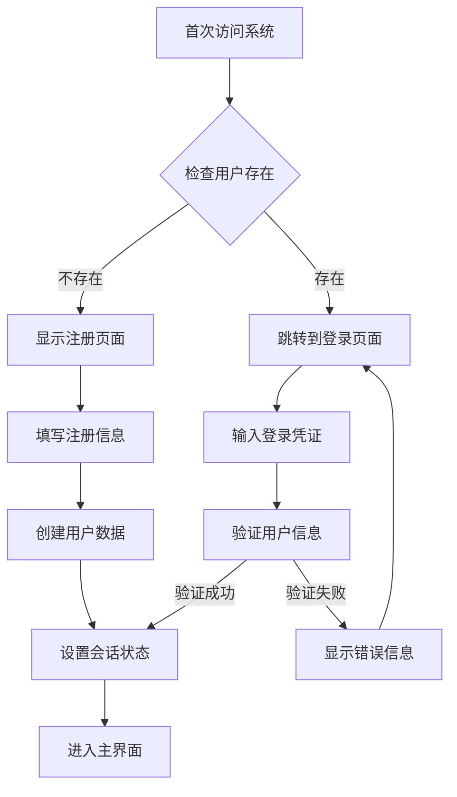

# 架构优化设计文档

## 1. Redis驱动架构设计

### 1.1 冷热存储分离架构

本项目采用Redis作为核心存储驱动，实现冷热数据分离：

#### 冷存储 (Cold Storage)
- **用户基础信息**：用户ID、注册时间、基础配置
- **系统配置**：全局设置、权限配置、系统状态
- **访问日志**：历史访问记录、操作日志

#### 热存储 (Hot Storage)
- **会话数据**：当前登录状态、会话令牌
- **缓存数据**：频繁访问的配置项、临时数据
- **实时状态**：在线状态、当前操作状态

### 1.2 Redis数据结构规划

```
# 用户数据 (Hash)
user:{user_id} -> {username, password_hash, created_at, last_login}

# 会话数据 (String with TTL)
session:{session_id} -> {user_id, login_time, expires_at}

# 系统配置 (Hash)
config:system -> {max_users, allow_registration, maintenance_mode}

# 访问统计 (Sorted Set)
stats:visits -> {timestamp, user_id, action}

# 临时缓存 (String with TTL)
cache:{key} -> {value}
```

## 2. 单用户系统架构

### 2.1 设计原则
- **唯一性**：系统只允许存在一个用户账户
- **首次注册**：首次访问时自动触发注册流程
- **安全隔离**：后续访问自动识别已注册用户

### 2.2 用户注册流程



### 2.3 数据完整性保证

- **原子性操作**：使用Redis事务确保用户创建的原子性
- **并发控制**：使用分布式锁防止并发注册
- **数据验证**：严格的输入验证和格式检查

## 3. Redis配置指南

### 3.1 环境变量配置

```bash
# Redis连接配置
REDIS_HOST=localhost
REDIS_PORT=6379
REDIS_PASSWORD=your_password
REDIS_DB=0

# 会话配置
SESSION_TTL=86400        # 会话过期时间(秒)
CACHE_TTL=3600           # 缓存过期时间(秒)

# 系统配置
MAX_LOGIN_ATTEMPTS=5     # 最大登录尝试次数
LOCKOUT_DURATION=300     # 账户锁定时间(秒)
```

### 3.2 Redis初始化步骤

1. **安装Redis服务**
   ```bash
   # Ubuntu/Debian
   sudo apt-get install redis-server
   
   # macOS
   brew install redis
   ```

2. **配置Redis密码**
   ```bash
   # 编辑redis配置文件
   sudo nano /etc/redis/redis.conf
   
   # 添加或修改以下配置
   requirepass your_strong_password
   ```

3. **启动Redis服务**
   ```bash
   sudo systemctl start redis
   sudo systemctl enable redis
   ```

4. **验证连接**
   ```bash
   redis-cli -a your_password ping
   # 应该返回: PONG
   ```

### 3.3 数据持久化配置

```bash
# 在redis.conf中配置持久化
save 900 1      # 900秒内有1个key变化则保存
save 300 10     # 300秒内有10个key变化则保存
save 60 10000   # 60秒内有10000个key变化则保存

# 启用AOF持久化
appendonly yes
appendfsync everysec
```

## 4. 安全考虑

### 4.1 数据安全
- **密码加密**：用户密码使用bcrypt加密存储
- **会话管理**：使用安全的随机会话ID
- **访问控制**：基于Redis的权限控制

### 4.2 系统安全
- **网络隔离**：Redis服务配置防火墙规则
- **连接加密**：支持TLS/SSL连接
- **监控告警**：异常访问监控和告警机制

## 5. 性能优化

### 5.1 Redis性能调优
- **内存优化**：合理设置maxmemory和淘汰策略
- **连接池**：使用连接池管理Redis连接
- **管道操作**：批量操作使用pipeline减少网络开销

### 5.2 缓存策略
- **分层缓存**：多级缓存架构设计
- **缓存预热**：系统启动时预加载常用数据
- **缓存更新**：实时更新与延迟更新结合

## 6. 开源考虑

### 6.1 代码结构
- **模块化设计**：清晰的模块划分和接口定义
- **文档完整**：详细的API文档和使用说明
- **配置灵活**：支持多种部署环境和配置方式

### 6.2 部署简化
- **容器化支持**：提供Docker容器化部署方案
- **一键脚本**：自动化部署和初始化脚本
- **环境隔离**：开发、测试、生产环境隔离