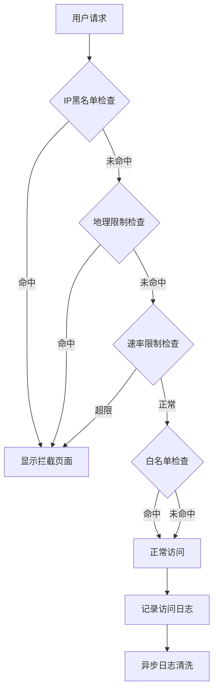

## 1. 产品概述
WAF防火墙产品提供Web应用安全防护功能，包括请求速率限制、地理访问控制、自定义拦截页面、黑白名单机制和访问日志监控。产品面向需要保护Web应用安全的站点管理员，通过多层防护机制确保网站安全稳定运行。

## 2. 核心功能

### 2.1 用户角色
| 角色 | 注册方式 | 核心权限 |
|------|----------|----------|
| 站点管理员 | 系统管理员分配 | 配置WAF规则、管理黑白名单、查看访问日志 |
| 系统管理员 | 默认账号 | 全局配置管理、站点管理 |

### 2.2 功能模块
WAF防火墙产品包含以下核心页面：
1. **控制台首页**：显示全球访问流量3D/2D可视化图表
2. **站点管理页面**：站点列表展示和WAF配置入口
3. **WAF设置页面**：速率限制、拦截页面、地理限制、黑白名单配置
4. **访问日志页面**：正常用户访问流量统计和日志查看

### 2.3 页面详情
| 页面名称 | 模块名称 | 功能描述 |
|----------|----------|----------|
| 控制台首页 | 流量可视化 | 展示基于全球地理位置的2D/3D访问流量图，支持K/M单位动态切换 |
| 站点管理 | 站点列表 | 显示所有站点，提供WAF设置入口 |
| WAF设置 | 速率限制 | 设置xx分钟xx次请求限制，仅针对非资源请求 |
| WAF设置 | 自定义拦截页面 | 上传自定义HTML拦截页面，未上传时使用默认页面 |
| WAF设置 | 地理访问限制 | 选择禁止访问的国家，提供全选/反选功能 |
| WAF设置 | 黑白名单 | 设置IP黑白名单，白名单放行，黑名单拦截 |
| 访问日志 | 日志监控 | 显示正常用户访问日志，支持按时间、地区筛选 |

## 3. 核心流程

### 管理员操作流程
1. 登录控制台查看首页流量可视化
2. 进入站点管理选择需要配置的站点
3. 在WAF设置页面配置各项防护规则
4. 查看访问日志监控防护效果

### 请求处理流程
1. 用户请求到达WAF网关
2. 检查IP是否在黑名单，是则拦截
3. 检查地理IP是否在禁止访问地区，是则拦截
4. 检查请求速率是否超限，是则拦截
5. 检查IP是否在白名单，是则放行
6. 记录访问日志并标记为未清洗
7. 异步任务清洗日志并更新地理位置信息

## 4. 用户界面设计

### 4.1 设计风格
- **主色调**：深蓝色 (#1e40af) 体现安全防护
- **辅助色**：红色 (#dc2626) 用于警告和拦截提示
- **按钮样式**：圆角矩形，悬停效果
- **字体**：系统默认字体，标题16px，正文14px
- **布局风格**：左侧导航+右侧内容区域
- **图标风格**：使用Shield、Lock等安全相关图标

### 4.2 页面设计
| 页面名称 | 模块名称 | UI元素 |
|----------|----------|--------|
| 首页 | 流量可视化 | 全屏2D世界地图，热力图显示访问量，右上角单位切换按钮 |
| WAF设置 | 速率限制 | 数字输入框设置分钟和次数，实时预览效果 |
| WAF设置 | 拦截页面 | 文件上传组件，支持HTML文件，实时预览上传的页面 |
| WAF设置 | 地理限制 | 多选国家列表，顶部全选/反选按钮，已选国家计数显示 |
| WAF设置 | 黑白名单 | IP地址输入框，批量导入功能，列表展示已添加IP |
| 访问日志 | 日志列表 | 表格展示访问记录，包含时间、IP、地理位置、状态 |

### 4.3 响应式设计
- 采用桌面优先设计，支持1920x1080标准分辨率
- 移动端适配：导航菜单折叠，图表自适应屏幕宽度
- 触摸交互优化：按钮增大点击区域，支持滑动操作