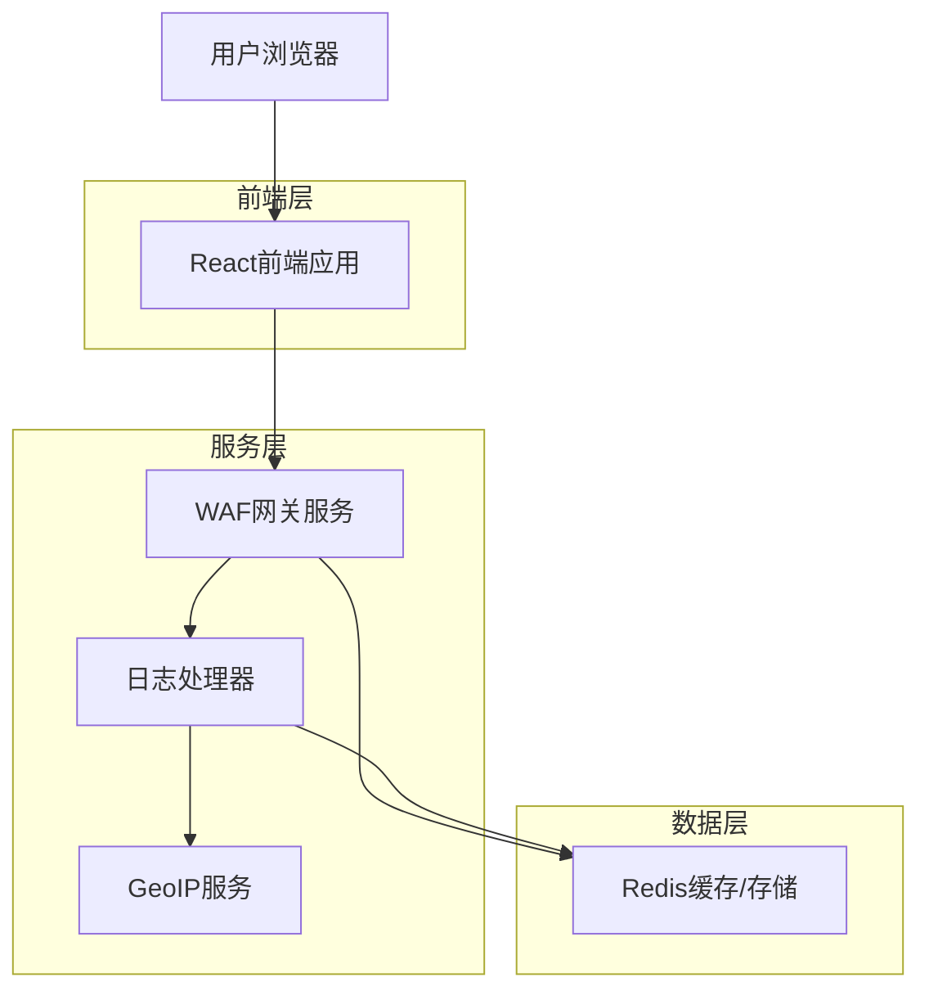
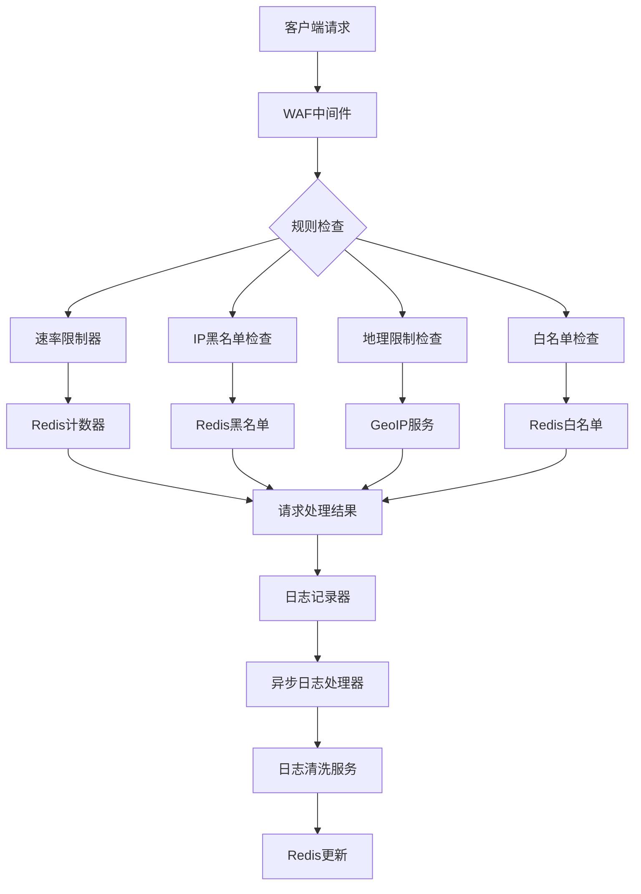

## 1. 架构设计



## 2. 技术栈描述

- **前端**: React@18 + TypeScript + TailwindCSS + Vite
- **初始化工具**: vite-init
- **后端**: Go + Gin框架
- **存储**: Redis (作为唯一数据库)
- **地理IP服务**: 第三方公开API

## 3. 路由定义

| 路由 | 用途 |
|------|------|
| / | 控制台首页，显示流量可视化 |
| /sites | 站点管理页面 |
| /sites/:id/waf | WAF设置页面 |
| /logs | 访问日志页面 |
| /api/auth/login | 用户登录 |
| /api/sites | 站点列表API |
| /api/sites/:id/waf | WAF配置API |
| /api/logs | 访问日志API |

## 4. API定义

### 4.1 核心API

**WAF配置更新**
```
PUT /api/sites/:id/waf
```

请求参数:
| 参数名 | 类型 | 必填 | 描述 |
|--------|------|------|------|
| rate_limit_count | number | false | 速率限制次数 |
| rate_limit_window | number | false | 速率限制时间窗口(分钟) |
| blocked_countries | string[] | false | 禁止访问的国家代码数组 |
| whitelist_ips | string[] | false | 白名单IP数组 |
| blacklist_ips | string[] | false | 黑名单IP数组 |
| custom_block_page | string | false | 自定义拦截页面HTML |

响应:
```json
{
  "success": true,
  "data": {
    "id": "site-123",
    "waf_config": {
      "rate_limit_count": 100,
      "rate_limit_window": 5,
      "blocked_countries": ["CN", "RU"],
      "whitelist_ips": ["192.168.1.1"],
      "blacklist_ips": ["10.0.0.1"],
      "custom_block_page": "<html>...</html>"
    }
  }
}
```

**访问日志查询**
```
GET /api/logs?site_id=:id&start_date=:start&end_date=:end&page=:page&limit=:limit
```

响应:
```json
{
  "success": true,
  "data": {
    "logs": [
      {
        "id": "log-123",
        "ip": "192.168.1.1",
        "country": "US",
        "city": "New York",
        "user_agent": "Mozilla/5.0...",
        "request_path": "/api/data",
        "status_code": 200,
        "created_at": "2024-01-06T10:00:00Z"
      }
    ],
    "total": 150,
    "page": 1,
    "limit": 20
  }
}
```

## 5. 服务端架构



## 6. 数据模型

### 6.1 Redis 键结构设计

**站点配置**
- Key: `site:{id}`
- Type: `String` (JSON)
- Content: `Site` struct serialized

**WAF配置**
- Key: `waf:config:{site_id}`
- Type: `String` (JSON)
- Content: `WafConfig` struct serialized (includes rules, blocked countries, IPs)

**访问日志**
- Key: `waf:logs:{site_id}`
- Type: `List` (JSON)
- Content: `AccessLog` struct serialized. Newest logs at head (LPUSH).

**全局统计**
- Key: `waf:stats:global:total` (Type: `Counter`)
- Key: `waf:stats:global:blocked` (Type: `Counter`)

**小时级统计**
- Key: `waf:stats:hourly:{timestamp}`
- Type: `Hash`
- Fields: `total`, `blocked`
- TTL: 7 days

**用户会话**
- Key: `session:{session_id}`
- Type: `Hash`
- Fields: `user_id`, `created_at`, `expires_at`

**用户信息**
- Key: `user:{user_id}`
- Type: `Hash`
- Fields: `id`, `username`, `password`

**用户名映射**
- Key: `username:{username}`
- Type: `String`
- Value: `user_id`