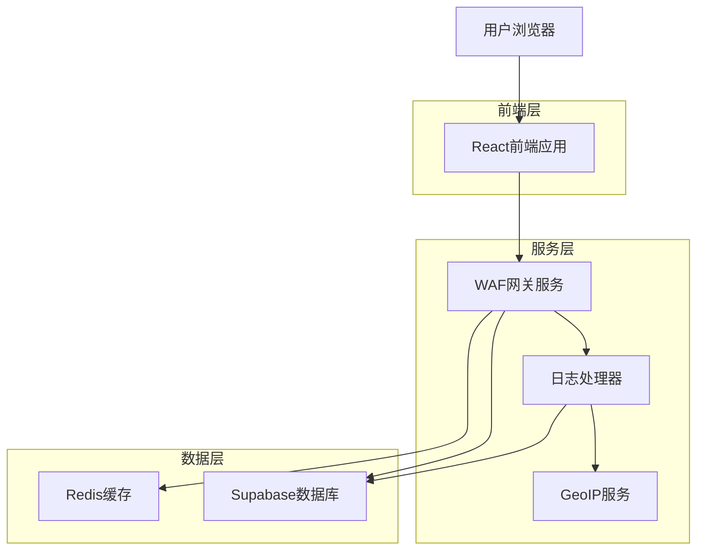
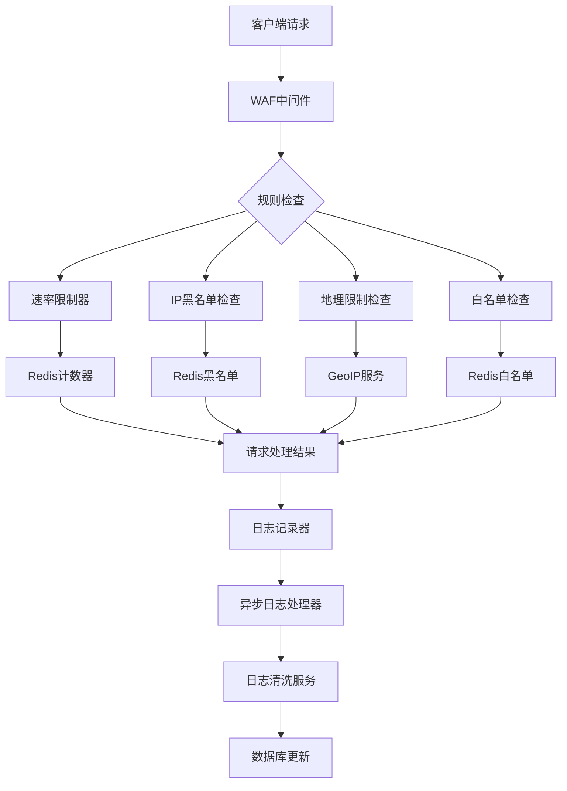
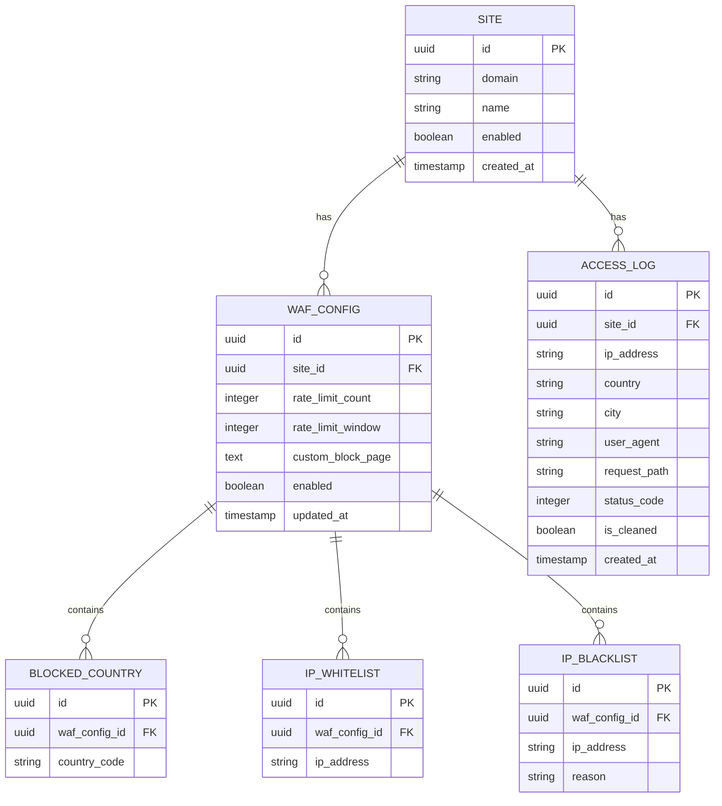

## 1. 架构设计



## 2. 技术栈描述

- **前端**: React@18 + TypeScript + TailwindCSS + Vite
- **初始化工具**: vite-init
- **后端**: Go + Gin框架
- **数据库**: Supabase (PostgreSQL)
- **缓存**: Redis
- **地理IP服务**: 第三方公开API

## 3. 路由定义

| 路由 | 用途 |
|------|------|
| / | 控制台首页，显示流量可视化 |
| /sites | 站点管理页面 |
| /sites/:id/waf | WAF设置页面 |
| /logs | 访问日志页面 |
| /api/auth/login | 用户登录 |
| /api/sites | 站点列表API |
| /api/sites/:id/waf | WAF配置API |
| /api/logs | 访问日志API |

## 4. API定义

### 4.1 核心API

**WAF配置更新**
```
PUT /api/sites/:id/waf
```

请求参数:
| 参数名 | 类型 | 必填 | 描述 |
|--------|------|------|------|
| rate_limit_count | number | false | 速率限制次数 |
| rate_limit_window | number | false | 速率限制时间窗口(分钟) |
| blocked_countries | string[] | false | 禁止访问的国家代码数组 |
| whitelist_ips | string[] | false | 白名单IP数组 |
| blacklist_ips | string[] | false | 黑名单IP数组 |
| custom_block_page | string | false | 自定义拦截页面HTML |

响应:
```json
{
  "success": true,
  "data": {
    "id": "site-123",
    "waf_config": {
      "rate_limit_count": 100,
      "rate_limit_window": 5,
      "blocked_countries": ["CN", "RU"],
      "whitelist_ips": ["192.168.1.1"],
      "blacklist_ips": ["10.0.0.1"],
      "custom_block_page": "<html>...</html>"
    }
  }
}
```

**访问日志查询**
```
GET /api/logs?site_id=:id&start_date=:start&end_date=:end&page=:page&limit=:limit
```

响应:
```json
{
  "success": true,
  "data": {
    "logs": [
      {
        "id": "log-123",
        "ip": "192.168.1.1",
        "country": "US",
        "city": "New York",
        "user_agent": "Mozilla/5.0...",
        "request_path": "/api/data",
        "status_code": 200,
        "created_at": "2024-01-06T10:00:00Z"
      }
    ],
    "total": 150,
    "page": 1,
    "limit": 20
  }
}
```

## 5. 服务端架构



## 6. 数据模型

### 6.1 数据模型定义



### 6.2 数据定义语言

**站点表 (sites)**
```sql
CREATE TABLE sites (
    id UUID PRIMARY KEY DEFAULT gen_random_uuid(),
    domain VARCHAR(255) UNIQUE NOT NULL,
    name VARCHAR(100) NOT NULL,
    enabled BOOLEAN DEFAULT true,
    created_at TIMESTAMP WITH TIME ZONE DEFAULT NOW(),
    updated_at TIMESTAMP WITH TIME ZONE DEFAULT NOW()
);
```

**WAF配置表 (waf_configs)**
```sql
CREATE TABLE waf_configs (
    id UUID PRIMARY KEY DEFAULT gen_random_uuid(),
    site_id UUID REFERENCES sites(id) ON DELETE CASCADE,
    rate_limit_count INTEGER DEFAULT 100,
    rate_limit_window INTEGER DEFAULT 5,
    custom_block_page TEXT,
    enabled BOOLEAN DEFAULT true,
    created_at TIMESTAMP WITH TIME ZONE DEFAULT NOW(),
    updated_at TIMESTAMP WITH TIME ZONE DEFAULT NOW()
);
```

**访问日志表 (access_logs)**
```sql
CREATE TABLE access_logs (
    id UUID PRIMARY KEY DEFAULT gen_random_uuid(),
    site_id UUID REFERENCES sites(id) ON DELETE CASCADE,
    ip_address INET NOT NULL,
    country VARCHAR(2),
    city VARCHAR(100),
    user_agent TEXT,
    request_path VARCHAR(500),
    status_code INTEGER,
    is_cleaned BOOLEAN DEFAULT false,
    created_at TIMESTAMP WITH TIME ZONE DEFAULT NOW()
);

-- 创建索引
CREATE INDEX idx_access_logs_site_id ON access_logs(site_id);
CREATE INDEX idx_access_logs_ip_address ON access_logs(ip_address);
CREATE INDEX idx_access_logs_created_at ON access_logs(created_at DESC);
CREATE INDEX idx_access_logs_is_cleaned ON access_logs(is_cleaned) WHERE is_cleaned = false;
```

**禁止国家表 (blocked_countries)**
```sql
CREATE TABLE blocked_countries (
    id UUID PRIMARY KEY DEFAULT gen_random_uuid(),
    waf_config_id UUID REFERENCES waf_configs(id) ON DELETE CASCADE,
    country_code VARCHAR(2) NOT NULL,
    UNIQUE(waf_config_id, country_code)
);
```

**IP白名单表 (ip_whitelists)**
```sql
CREATE TABLE ip_whitelists (
    id UUID PRIMARY KEY DEFAULT gen_random_uuid(),
    waf_config_id UUID REFERENCES waf_configs(id) ON DELETE CASCADE,
    ip_address INET NOT NULL,
    UNIQUE(waf_config_id, ip_address)
);
```

**IP黑名单表 (ip_blacklists)**
```sql
CREATE TABLE ip_blacklists (
    id UUID PRIMARY KEY DEFAULT gen_random_uuid(),
    waf_config_id UUID REFERENCES waf_configs(id) ON DELETE CASCADE,
    ip_address INET NOT NULL,
    reason VARCHAR(255),
    created_at TIMESTAMP WITH TIME ZONE DEFAULT NOW(),
    UNIQUE(waf_config_id, ip_address)
);
```