# Prerender Shield — 完整功能架构图

> 本文档包含系统每个功能模块的详细架构图，基于实际源码绘制。
> 更新日期: 2026-06-17

---

## 目录

1. [系统总架构](#1-系统总架构)
2. [应用启动流程](#2-应用启动流程)
3. [请求处理流程（站点层）](#3-请求处理流程站点层)
4. [WAF 防火墙引擎](#4-waf-防火墙引擎)
5. [预渲染/SEO 引擎](#5-预渲染seo-引擎)
6. [SEO/AEO 优化体系](#6-seoaeo-优化体系)
7. [SSL/TLS 证书管理](#7-ssltls-证书管理)
8. [认证与用户管理](#8-认证与用户管理)
9. [监控与告警体系](#9-监控与告警体系)
10. [日志系统](#10-日志系统)
11. [推送/IndexNow](#11-推送indexnow)
12. [爬虫识别与管理](#12-爬虫识别与管理)
13. [配置管理系统](#13-配置管理系统)
14. [定时调度器](#14-定时调度器)
15. [前端架构](#15-前端架构)
16. [数据存储模型](#16-数据存储模型)
17. [部署架构](#17-部署架构)

---

## 1. 系统总架构

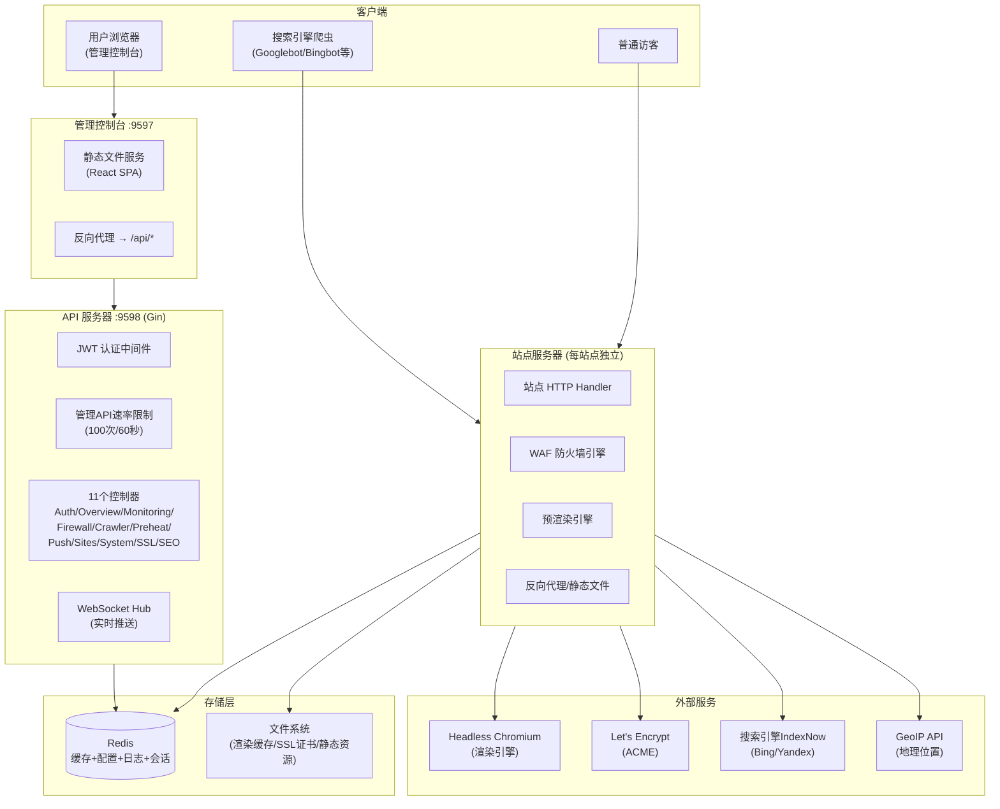
```mermaid
graph TB
    subgraph Client["客户端"]
        Browser["用户浏览器<br/>(管理控制台)"]
        Crawler["搜索引擎爬虫<br/>(Googlebot/Bingbot等)"]
        Visitor["普通访客"]
    end

    subgraph ConsoleServer["管理控制台 :9597"]
        StaticFiles["静态文件服务<br/>(React SPA)"]
        Proxy1["反向代理 → /api/*"]
    end

    subgraph APIServer["API 服务器 :9598 (Gin)"]
        AuthMW["JWT 认证中间件"]
        RateLimitMW["管理API速率限制<br/>(100次/60秒)"]
        Controllers["11个控制器<br/>Auth/Overview/Monitoring/<br/>Firewall/Crawler/Preheat/<br/>Push/Sites/System/SSL/SEO"]
        WSHub["WebSocket Hub<br/>(实时推送)"]
    end

    subgraph SiteServer["站点服务器 (每站点独立)"]
        SiteHandler["站点 HTTP Handler"]
        WAFEngine["WAF 防火墙引擎"]
        PrerenderEngine["预渲染引擎"]
        ProxyEngine["反向代理/静态文件"]
    end

    subgraph Storage["存储层"]
        Redis[("Redis<br/>缓存+配置+日志+会话")]
        FileSystem["文件系统<br/>(渲染缓存/SSL证书/静态资源)"]
    end

    subgraph External["外部服务"]
        Chromium["Headless Chromium<br/>(渲染引擎)"]
        LE["Let's Encrypt<br/>(ACME)"]
        IndexNow["搜索引擎IndexNow<br/>(Bing/Yandex)"]
        GeoIP["GeoIP API<br/>(地理位置)"]
    end

    Browser --> ConsoleServer
    Crawler --> SiteServer
    Visitor --> SiteServer

    ConsoleServer --> APIServer
    APIServer --> Redis

    SiteServer --> Redis
    SiteServer --> FileSystem
    SiteServer --> Chromium
    SiteServer --> LE
    SiteServer --> IndexNow
    SiteServer --> GeoIP
```

---

## 2. 应用启动流程

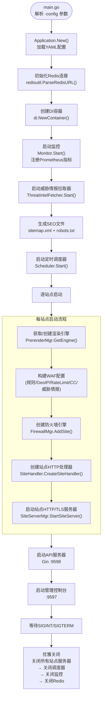
```mermaid
flowchart TD
    Start(["main.go<br/>解析 -config 参数"]) --> NewApp["Application.New()<br/>加载YAML配置"]
    NewApp --> InitRedis["初始化Redis连接<br/>redisutil.ParseRedisURL()"]
    InitRedis --> CreateDI["创建DI容器<br/>di.NewContainer()"]
    CreateDI --> InitMonitor["启动监控<br/>Monitor.Start()<br/>注册Prometheus指标"]
    InitMonitor --> InitThreatIntel["启动威胁情报拉取器<br/>ThreatIntelFetcher.Start()"]
    InitThreatIntel --> GenSEO["生成SEO文件<br/>sitemap.xml + robots.txt"]
    GenSEO --> StartScheduler["启动定时调度器<br/>Scheduler.Start()"]
    StartScheduler --> StartSites["逐站点启动"]

    subgraph PerSite["每站点启动流程"]
        direction TB
        S1["获取/创建渲染引擎<br/>PrerenderMgr.GetEngine()"]
        S2["构建WAF配置<br/>(规则/GeoIP/RateLimit/CC/威胁情报)"]
        S3["创建防火墙引擎<br/>FirewallMgr.AddSite()"]
        S4["创建站点HTTP处理器<br/>SiteHandler.CreateSiteHandler()"]
        S5["启动站点HTTP/TLS服务器<br/>SiteServerMgr.StartSiteServer()"]
        S1 --> S2 --> S3 --> S4 --> S5
    end

    StartSites --> PerSite
    PerSite --> StartAPI["启动API服务器<br/>Gin :9598"]
    StartAPI --> StartConsole["启动管理控制台<br/>:9597"]
    StartConsole --> WaitSignal["等待SIGINT/SIGTERM"]
    WaitSignal --> GracefulShutdown["优雅关闭<br/>关闭所有站点服务器<br/>→ 关闭调度器<br/>→ 关闭监控<br/>→ 关闭Redis"]
```

---

## 3. 请求处理流程（站点层）

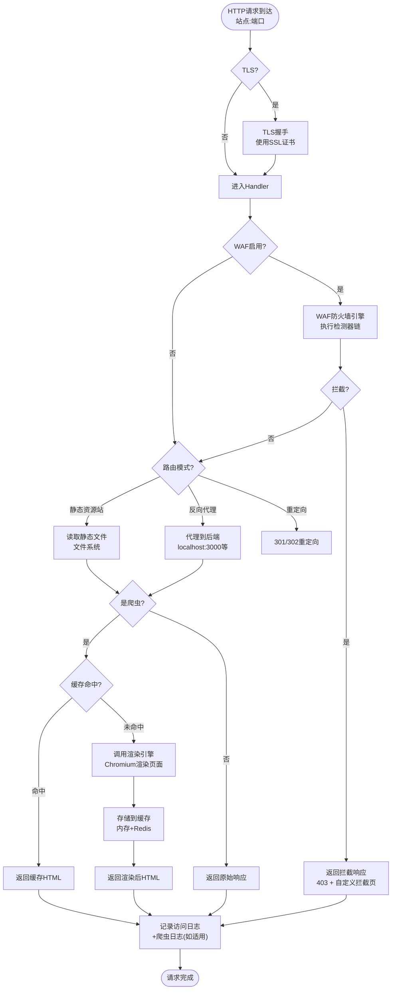
```mermaid
flowchart TD
    Request(["HTTP请求到达<br/>站点:端口"]) --> CheckTLS{"TLS?"}
    CheckTLS -->|是| TLSHandshake["TLS握手<br/>使用SSL证书"]
    CheckTLS -->|否| Continue
    TLSHandshake --> Continue["进入Handler"]

    Continue --> WAFCheck{"WAF启用?"}
    WAFCheck -->|否| Route
    WAFCheck -->|是| WAFEngine["WAF防火墙引擎<br/>执行检测器链"]

    WAFEngine --> WAFResult{"拦截?"}
    WAFResult -->|是| BlockResp["返回拦截响应<br/>403 + 自定义拦截页"]
    WAFResult -->|否| Route{"路由模式?"}

    Route -->|静态资源站| StaticFile["读取静态文件<br/>文件系统"]
    Route -->|反向代理| ProxyUpstream["代理到后端<br/>localhost:3000等"]
    Route -->|重定向| RedirectResp["301/302重定向"]

    StaticFile --> CrawlerCheck
    ProxyUpstream --> CrawlerCheck

    CrawlerCheck{"是爬虫?"}
    CrawlerCheck -->|是| CacheCheck{"缓存命中?"}
    CrawlerCheck -->|否| ReturnResp["返回原始响应"]

    CacheCheck -->|命中| ReturnCache["返回缓存HTML"]
    CacheCheck -->|未命中| Render["调用渲染引擎<br/>Chromium渲染页面"]
    Render --> StoreCache["存储到缓存<br/>内存+Redis"]
    StoreCache --> ReturnRender["返回渲染后HTML"]

    ReturnCache --> LogRequest
    ReturnRender --> LogRequest
    ReturnResp --> LogRequest
    BlockResp --> LogRequest

    LogRequest["记录访问日志<br/>+爬虫日志(如适用)"]
    LogRequest --> Done(["请求完成"])
```

---

## 4. WAF 防火墙引擎

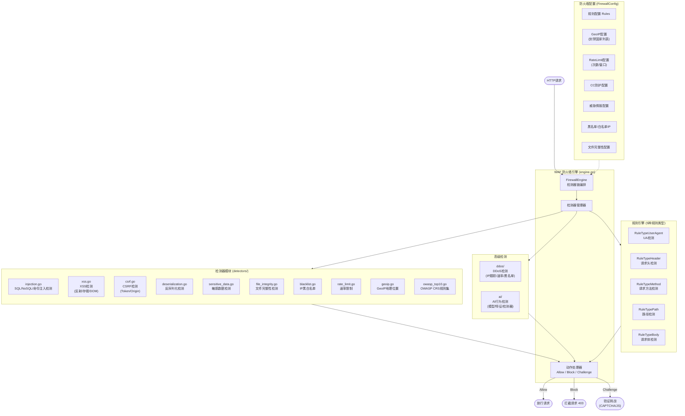
```mermaid
graph TB
    subgraph FirewallEngine["WAF 防火墙引擎 (engine.go)"]
        Engine["FirewallEngine<br/>检测器链编排"]
        ActionHandler["动作处理器<br/>Allow / Block / Challenge"]
        DetectorManager["检测器管理器"]
    end

    subgraph Detectors["检测器模块 (detectors/)"]
        direction TB
        D1["injection.go<br/>SQL/NoSQL/命令注入检测"]
        D2["xss.go<br/>XSS检测<br/>(反射/存储/DOM)"]
        D3["csrf.go<br/>CSRF检测<br/>(Token/Origin)"]
        D4["deserialization.go<br/>反序列化检测"]
        D5["sensitive_data.go<br/>敏感数据检测"]
        D6["file_integrity.go<br/>文件完整性检测"]
        D7["blacklist.go<br/>IP黑白名单"]
        D8["rate_limit.go<br/>速率限制"]
        D9["geoip.go<br/>GeoIP地理位置"]
        D10["owasp_top10.go<br/>OWASP CRS规则集"]
    end

    subgraph Advanced["高级检测"]
        DDOS["ddos/<br/>DDoS检测<br/>(IP跟踪/速率/黑名单)"]
        AI["ai/<br/>AI行为检测<br/>(模型/特征/检测器)"]
    end

    subgraph RuleEngine["规则引擎 (5种规则类型)"]
        R1["RuleTypeUserAgent<br/>UA检测"]
        R2["RuleTypeHeader<br/>请求头检测"]
        R3["RuleTypeMethod<br/>请求方法检测"]
        R4["RuleTypePath<br/>路径检测"]
        R5["RuleTypeBody<br/>请求体检测"]
    end

    subgraph Config["防火墙配置 (FirewallConfig)"]
        FC1["规则配置 Rules"]
        FC2["GeoIP配置<br/>(封禁国家列表)"]
        FC3["RateLimit配置<br/>(次数/窗口)"]
        FC4["CC防护配置"]
        FC5["威胁情报配置"]
        FC6["黑名单/白名单IP"]
        FC7["文件完整性配置"]
    end

    Request(["HTTP请求"]) --> Engine
    Engine --> DetectorManager
    DetectorManager --> Detectors
    DetectorManager --> Advanced
    DetectorManager --> RuleEngine
    Config -.-> Engine

    Detectors --> ActionHandler
    Advanced --> ActionHandler
    RuleEngine --> ActionHandler

    ActionHandler -->|Allow| PassReq(["放行请求"])
    ActionHandler -->|Block| BlockReq(["拦截请求 403"])
    ActionHandler -->|Challenge| Challenge(["验证挑战<br/>(CAPTCHA/JS)"])
```

---

## 5. 预渲染/SEO 引擎

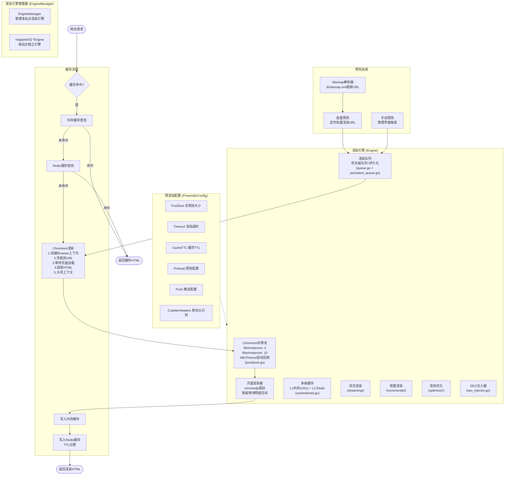
```mermaid
graph TB
    subgraph EngineManager["渲染引擎管理器 (EngineManager)"]
        Mgr["EngineManager<br/>管理多站点渲染引擎"]
        Engines["map[siteID] *Engine<br/>每站点独立引擎"]
    end

    subgraph Engine["渲染引擎 (Engine)"]
        Pool["Chromium实例池<br/>MinInstances: 2<br/>MaxInstances: 10<br/>IdleTimeout自动回收<br/>(pool/pool.go)"]
        Renderer["页面渲染器<br/>chromedp驱动<br/>智能等待网络空闲"]
        Cache["多级缓存<br/>L1内存(LRU) + L2 Redis<br/>(cache/tiered.go)"]
        Queue["渲染队列<br/>优先级队列+持久化<br/>(queue.go + persistent_queue.go)"]
        Stream["流式渲染<br/>(streaming/)"]
        Incr["增量渲染<br/>(incremental/)"]
        Opt["渲染优化<br/>(optimizer/)"]
        SEOInj["SEO注入器<br/>(seo_injector.go)"]
    end

    subgraph Preheat["预热系统"]
        SitemapParser["Sitemap解析器<br/>从sitemap.xml提取URL"]
        BatchPreheat["批量预热<br/>定时批量渲染URL"]
        ManualPreheat["手动预热<br/>管理界面触发"]
    end

    subgraph CacheFlow["缓存流程"]
        CheckCache{"缓存命中?"}
        MemCache["内存缓存查找"]
        RedisCache["Redis缓存查找"]
        RenderPage["Chromium渲染<br/>1.创建Browser上下文<br/>2.导航到URL<br/>3.等待页面加载<br/>4.提取HTML<br/>5.关闭上下文"]
        StoreMem["写入内存缓存"]
        StoreRedis["写入Redis缓存<br/>TTL过期"]
    end

    subgraph Config["预渲染配置 (PrerenderConfig)"]
        PC1["PoolSize 实例池大小"]
        PC2["Timeout 渲染超时"]
        PC3["CacheTTL 缓存TTL"]
        PC4["Preheat 预热配置"]
        PC5["Push 推送配置"]
        PC6["CrawlerHeaders 爬虫头识别"]
    end

    CrawlerReq(["爬虫请求"]) --> CheckCache
    CheckCache -->|是| MemCache
    MemCache -->|未命中| RedisCache
    MemCache -->|命中| ReturnCache(["返回缓存HTML"])
    RedisCache -->|命中| ReturnCache
    RedisCache -->|未命中| RenderPage

    RenderPage --> Pool
    Pool --> Renderer
    Renderer --> StoreMem
    StoreMem --> StoreRedis
    StoreRedis --> ReturnRender(["返回渲染HTML"])

    SitemapParser --> BatchPreheat
    BatchPreheat --> Queue
    ManualPreheat --> Queue
    Queue --> RenderPage

    Config -.-> Engine
```

---

## 6. SEO/AEO 优化体系

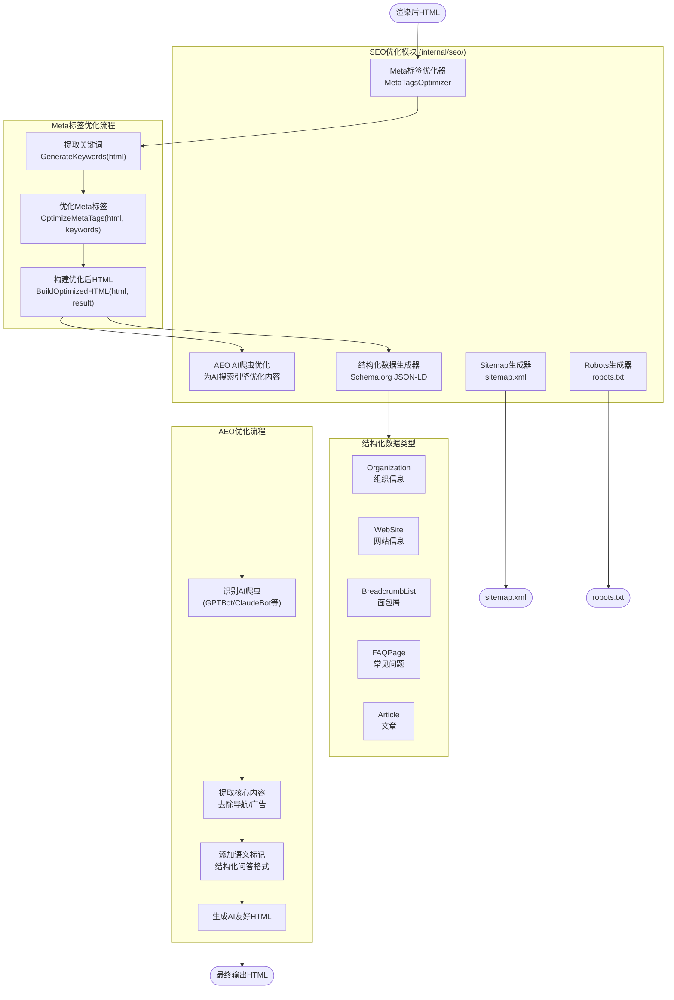
```mermaid
graph TB
    subgraph SEOModule["SEO优化模块 (internal/seo/)"]
        MetaOptimizer["Meta标签优化器<br/>MetaTagsOptimizer"]
        StructuredData["结构化数据生成器<br/>Schema.org JSON-LD"]
        AEO["AEO AI爬虫优化<br/>为AI搜索引擎优化内容"]
        SitemapGen["Sitemap生成器<br/>sitemap.xml"]
        RobotsGen["Robots生成器<br/>robots.txt"]
    end

    subgraph MetaFlow["Meta标签优化流程"]
        ExtractKW["提取关键词<br/>GenerateKeywords(html)"]
        OptimizeMeta["优化Meta标签<br/>OptimizeMetaTags(html, keywords)"]
        BuildHTML["构建优化后HTML<br/>BuildOptimizedHTML(html, result)"]
    end

    subgraph StructuredDataTypes["结构化数据类型"]
        SD1["Organization<br/>组织信息"]
        SD2["WebSite<br/>网站信息"]
        SD3["BreadcrumbList<br/>面包屑"]
        SD4["FAQPage<br/>常见问题"]
        SD5["Article<br/>文章"]
    end

    subgraph AEOFlow["AEO优化流程"]
        AEO1["识别AI爬虫<br/>(GPTBot/ClaudeBot等)"]
        AEO2["提取核心内容<br/>去除导航/广告"]
        AEO3["添加语义标记<br/>结构化问答格式"]
        AEO4["生成AI友好HTML"]
    end

    RenderedHTML(["渲染后HTML"]) --> MetaOptimizer
    MetaOptimizer --> ExtractKW --> OptimizeMeta --> BuildHTML
    BuildHTML --> StructuredData
    StructuredData --> StructuredDataTypes
    BuildHTML --> AEO

    AEO --> AEO1 --> AEO2 --> AEO3 --> AEO4
    AEO4 --> FinalHTML(["最终输出HTML"])

    SitemapGen --> SitemapFile(["sitemap.xml"])
    RobotsGen --> RobotsFile(["robots.txt"])
```

---

## 7. SSL/TLS 证书管理

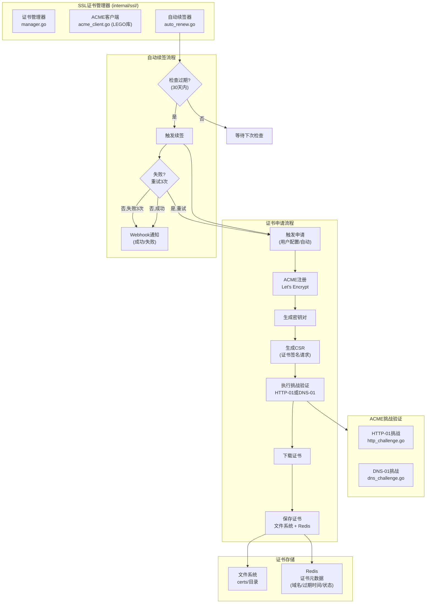
```mermaid
flowchart TD
    subgraph SSLManager["SSL证书管理器 (internal/ssl/)"]
        Manager["证书管理器<br/>manager.go"]
        ACMEClient["ACME客户端<br/>acme_client.go (LEGO库)"]
        AutoRenew["自动续签器<br/>auto_renew.go"]
    end

    subgraph Challenges["ACME挑战验证"]
        HTTPChallenge["HTTP-01挑战<br/>http_challenge.go"]
        DNSChallenge["DNS-01挑战<br/>dns_challenge.go"]
    end

    subgraph Flow["证书申请流程"]
        Trigger["触发申请<br/>(用户配置/自动)"]
        ACMEReg["ACME注册<br/>Let's Encrypt"]
        GenKey["生成密钥对"]
        GenCSR["生成CSR<br/>(证书签名请求)"]
        DoChallenge["执行挑战验证<br/>HTTP-01或DNS-01"]
        DownloadCert["下载证书"]
        SaveCert["保存证书<br/>文件系统 + Redis"]
    end

    subgraph RenewFlow["自动续签流程"]
        CheckExpiry{"检查过期?<br/>(30天内)"}
        RenewTrigger["触发续签"]
        Retry{"失败?<br/>重试3次"}
        WebhookNotify["Webhook通知<br/>(成功/失败)"]
    end

    subgraph Storage["证书存储"]
        CertFile["文件系统<br/>certs/目录"]
        CertRedis["Redis<br/>证书元数据<br/>(域名/过期时间/状态)"]
    end

    Trigger --> ACMEReg --> GenKey --> GenCSR --> DoChallenge
    DoChallenge --> Challenges
    DoChallenge --> DownloadCert --> SaveCert
    SaveCert --> CertFile
    SaveCert --> CertRedis

    AutoRenew --> CheckExpiry
    CheckExpiry -->|是| RenewTrigger
    RenewTrigger --> Trigger
    CheckExpiry -->|否| Wait["等待下次检查"]
    RenewTrigger --> Retry
    Retry -->|是,重试| Trigger
    Retry -->|否,成功| WebhookNotify
    Retry -->|否,失败3次| WebhookNotify
```

---

## 8. 认证与用户管理

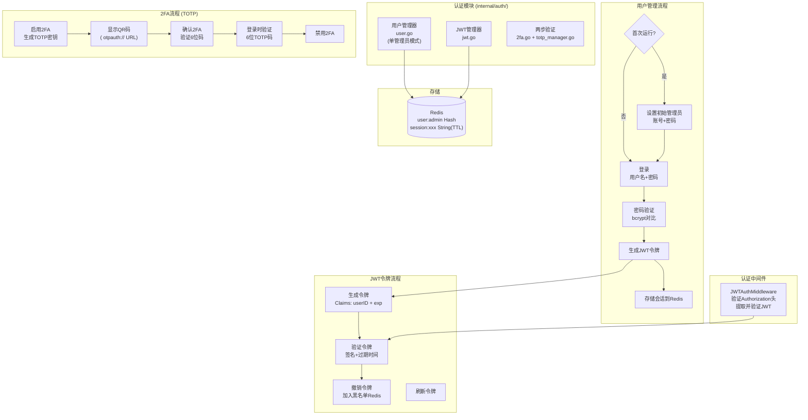
```mermaid
graph TB
    subgraph AuthModule["认证模块 (internal/auth/)"]
        UserManager["用户管理器<br/>user.go<br/>(单管理员模式)"]
        JWTManager["JWT管理器<br/>jwt.go"]
        TwoFA["两步验证<br/>2fa.go + totp_manager.go"]
    end

    subgraph UserFlow["用户管理流程"]
        FirstRun{"首次运行?"}
        Setup["设置初始管理员<br/>账号+密码"]
        Login["登录<br/>用户名+密码"]
        AuthCheck["密码验证<br/>bcrypt对比"]
        GenJWT["生成JWT令牌"]
        StoreSession["存储会话到Redis"]
    end

    subgraph JWTFlow["JWT令牌流程"]
        GenToken["生成令牌<br/>Claims: userID + exp"]
        ValidateToken["验证令牌<br/>签名+过期时间"]
        RevokeToken["撤销令牌<br/>加入黑名单Redis"]
        RefreshToken["刷新令牌"]
    end

    subgraph TwoFAFlow["2FA流程 (TOTP)"]
        Enable2FA["启用2FA<br/>生成TOTP密钥"]
        ShowQR["显示QR码<br/>( otpauth:// URL)"]
        Confirm2FA["确认2FA<br/>验证6位码"]
        Verify2FA["登录时验证<br/>6位TOTP码"]
        Disable2FA["禁用2FA"]
    end

    subgraph Middleware["认证中间件"]
        JWTMW["JWTAuthMiddleware<br/>验证Authorization头<br/>提取并验证JWT"]
    end

    subgraph Storage["存储"]
        UserRedis[("Redis<br/>user:admin Hash<br/>session:xxx String(TTL)")]
    end

    FirstRun -->|是| Setup
    FirstRun -->|否| Login
    Login --> AuthCheck --> GenJWT --> StoreSession
    Setup --> Login

    GenJWT --> GenToken
    GenToken --> ValidateToken
    ValidateToken --> RevokeToken

    Enable2FA --> ShowQR --> Confirm2FA
    Confirm2FA --> Verify2FA
    Verify2FA --> Disable2FA

    JWTMW --> ValidateToken
    UserManager --> UserRedis
    JWTManager --> UserRedis
```

---

## 9. 监控与告警体系

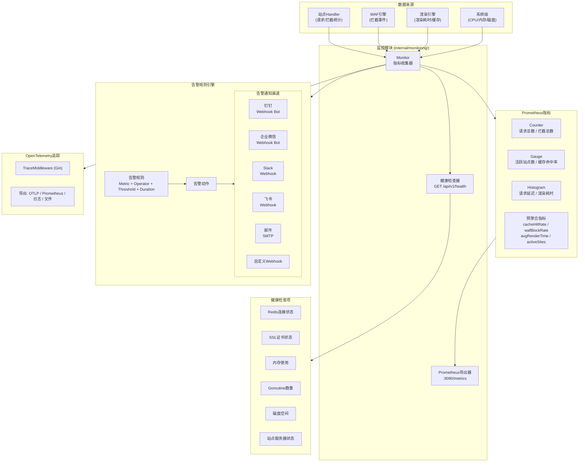
```mermaid
graph TB
    subgraph MonitorModule["监控模块 (internal/monitoring/)"]
        Monitor["Monitor<br/>指标收集器"]
        PromExporter["Prometheus导出器<br/>:9090/metrics"]
        HealthChecker["健康检查器<br/>GET /api/v1/health"]
    end

    subgraph Metrics["Prometheus指标"]
        M1["Counter<br/>请求总数 / 拦截总数"]
        M2["Gauge<br/>活跃站点数 / 缓存命中率"]
        M3["Histogram<br/>请求延迟 / 渲染耗时"]
        M4["预聚合指标<br/>cacheHitRate / wafBlockRate<br/>avgRenderTime / activeSites"]
    end

    subgraph Health["健康检查项"]
        H1["Redis连接状态"]
        H2["SSL证书状态"]
        H3["内存使用"]
        H4["Goroutine数量"]
        H5["磁盘空间"]
        H6["站点服务器状态"]
    end

    subgraph AlertEngine["告警规则引擎"]
        Rule["告警规则<br/>Metric + Operator + Threshold + Duration"]
        Actions["告警动作"]
        Channels["通知渠道"]
    end

    subgraph Channels["告警通知渠道"]
        C1["钉钉<br/>Webhook Bot"]
        C2["企业微信<br/>Webhook Bot"]
        C3["Slack<br/>Webhook"]
        C4["飞书<br/>Webhook"]
        C5["邮件<br/>SMTP"]
        C6["自定义Webhook"]
    end

    subgraph Telemetry["OpenTelemetry追踪"]
        OT1["TraceMiddleware (Gin)"]
        OT2["导出: OTLP / Prometheus / 日志 / 文件"]
    end

    subgraph DataSource["数据来源"]
        DS1["站点Handler<br/>(请求/拦截统计)"]
        DS2["WAF引擎<br/>(拦截事件)"]
        DS3["渲染引擎<br/>(渲染耗时/缓存)"]
        DS4["系统级<br/>(CPU/内存/磁盘)"]
    end

    DS1 --> Monitor
    DS2 --> Monitor
    DS3 --> Monitor
    DS4 --> Monitor

    Monitor --> Metrics
    Metrics --> PromExporter

    Monitor --> HealthChecker
    HealthChecker --> Health

    Monitor --> AlertEngine
    Rule --> Actions
    Actions --> Channels

    Monitor --> Telemetry
```

---

## 10. 日志系统

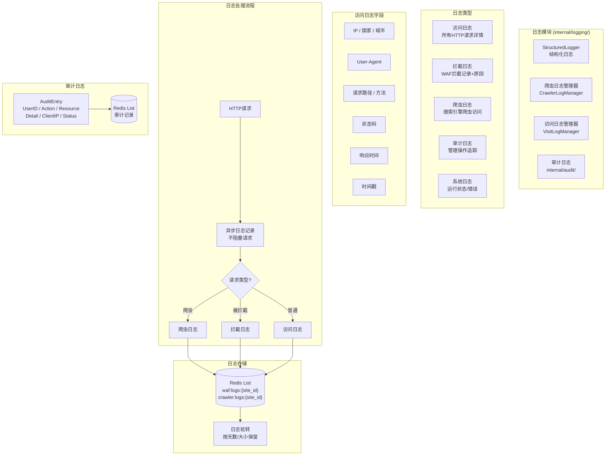
```mermaid
graph TB
    subgraph LoggingModule["日志模块 (internal/logging/)"]
        StructuredLogger["StructuredLogger<br/>结构化日志"]
        CrawlerLogMgr["爬虫日志管理器<br/>CrawlerLogManager"]
        VisitLogMgr["访问日志管理器<br/>VisitLogManager"]
        AuditLogger["审计日志<br/>internal/audit/"]
    end

    subgraph LogTypes["日志类型"]
        LT1["访问日志<br/>所有HTTP请求详情"]
        LT2["拦截日志<br/>WAF拦截记录+原因"]
        LT3["爬虫日志<br/>搜索引擎爬虫访问"]
        LT4["审计日志<br/>管理操作追踪"]
        LT5["系统日志<br/>运行状态/错误"]
    end

    subgraph AccessLog["访问日志字段"]
        AL1["IP / 国家 / 城市"]
        AL2["User-Agent"]
        AL3["请求路径 / 方法"]
        AL4["状态码"]
        AL5["响应时间"]
        AL6["时间戳"]
    end

    subgraph Storage["日志存储"]
        LogRedis[("Redis List<br/>waf:logs:{site_id}<br/>crawler:logs:{site_id}")]
        LogRotate["日志轮转<br/>按天数/大小保留"]
    end

    subgraph Flow["日志处理流程"]
        Request["HTTP请求"] --> AsyncLog["异步日志记录<br/>不阻塞请求"]
        AsyncLog --> Classify{"请求类型?"}
        Classify -->|爬虫| CrawlerLog["爬虫日志"]
        Classify -->|被拦截| BlockLog["拦截日志"]
        Classify -->|普通| AccessLog2["访问日志"]
        CrawlerLog --> LogRedis
        BlockLog --> LogRedis
        AccessLog2 --> LogRedis
        LogRedis --> LogRotate
    end

    subgraph Audit["审计日志"]
        AuditEntry["AuditEntry<br/>UserID / Action / Resource<br/>Detail / ClientIP / Status"]
        AuditStore[("Redis List<br/>审计记录")]
    end

    AuditEntry --> AuditStore
```

---

## 11. 推送/IndexNow

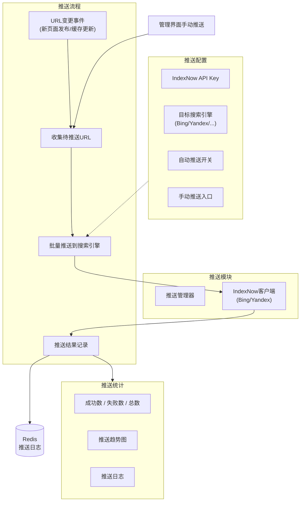
```mermaid
flowchart TD
    subgraph PushModule["推送模块"]
        PushManager["推送管理器"]
        IndexNowClient["IndexNow客户端<br/>(Bing/Yandex)"]
    end

    subgraph PushFlow["推送流程"]
        URLChange["URL变更事件<br/>(新页面发布/缓存更新)"]
        CollectURLs["收集待推送URL"]
        BatchPush["批量推送到搜索引擎"]
        PushResult["推送结果记录"]
    end

    subgraph PushConfig["推送配置"]
        PC1["IndexNow API Key"]
        PC2["目标搜索引擎<br/>(Bing/Yandex/...)"]
        PC3["自动推送开关"]
        PC4["手动推送入口"]
    end

    subgraph PushStats["推送统计"]
        PS1["成功数 / 失败数 / 总数"]
        PS2["推送趋势图"]
        PS3["推送日志"]
    end

    URLChange --> CollectURLs --> BatchPush
    PushConfig -.-> BatchPush
    BatchPush --> IndexNowClient
    IndexNowClient --> PushResult
    PushResult --> PushStats
    PushResult --> LogStore[("Redis<br/>推送日志")]

    ManualPush["管理界面手动推送"] --> CollectURLs
```

---

## 12. 爬虫识别与管理

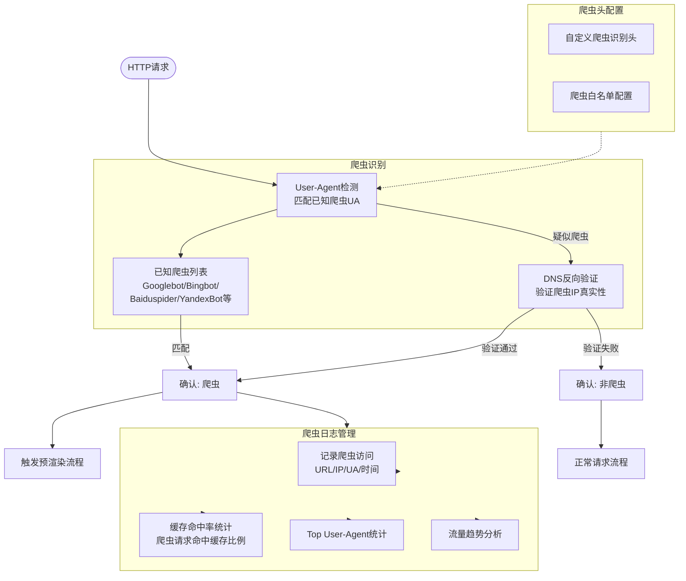
```mermaid
graph TB
    subgraph CrawlerDetection["爬虫识别"]
        UACheck["User-Agent检测<br/>匹配已知爬虫UA"]
        DNSVerify["DNS反向验证<br/>验证爬虫IP真实性"]
        BotList["已知爬虫列表<br/>Googlebot/Bingbot/<br/>Baiduspider/YandexBot等"]
    end

    subgraph CrawlerLog["爬虫日志管理"]
        CLog1["记录爬虫访问<br/>URL/IP/UA/时间"]
        CLog2["缓存命中率统计<br/>爬虫请求命中缓存比例"]
        CLog3["Top User-Agent统计"]
        CLog4["流量趋势分析"]
    end

    subgraph CrawlerHeaders["爬虫头配置"]
        CH1["自定义爬虫识别头"]
        CH2["爬虫白名单配置"]
    end

    Request(["HTTP请求"]) --> UACheck
    UACheck --> BotList
    UACheck -->|疑似爬虫| DNSVerify
    DNSVerify -->|验证通过| IsCrawler["确认: 爬虫"]
    DNSVerify -->|验证失败| NotCrawler["确认: 非爬虫"]
    BotList -->|匹配| IsCrawler

    IsCrawler --> TriggerRender["触发预渲染流程"]
    NotCrawler --> NormalFlow["正常请求流程"]

    IsCrawler --> CrawlerLog
    CrawlerHeaders -.-> UACheck

    CrawlerLog --> CLog1
    CrawlerLog --> CLog2
    CrawlerLog --> CLog3
    CrawlerLog --> CLog4
```

---

## 13. 配置管理系统

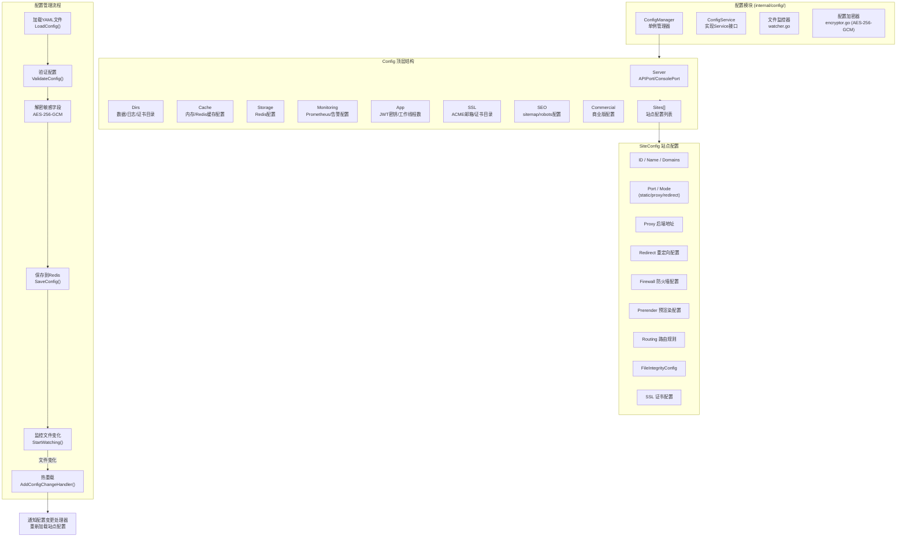
```mermaid
graph TB
    subgraph ConfigModule["配置模块 (internal/config/)"]
        ConfigManager["ConfigManager<br/>单例管理器"]
        ConfigService["ConfigService<br/>实现Service接口"]
        Watcher["文件监控器<br/>watcher.go"]
        Encryptor["配置加密器<br/>encryptor.go (AES-256-GCM)"]
    end

    subgraph ConfigStruct["Config 顶层结构"]
        Server["Server<br/>APIPort/ConsolePort"]
        Dirs["Dirs<br/>数据/日志/证书目录"]
        Cache["Cache<br/>内存/Redis缓存配置"]
        Storage["Storage<br/>Redis配置"]
        Monitoring["Monitoring<br/>Prometheus/告警配置"]
        App["App<br/>JWT密钥/工作线程数"]
        SSL["SSL<br/>ACME邮箱/证书目录"]
        SEO["SEO<br/>sitemap/robots配置"]
        Commercial["Commercial<br/>商业版配置"]
        Sites["Sites[]<br/>站点配置列表"]
    end

    subgraph SiteConfig["SiteConfig 站点配置"]
        SC1["ID / Name / Domains"]
        SC2["Port / Mode<br/>(static/proxy/redirect)"]
        SC3["Proxy 后端地址"]
        SC4["Redirect 重定向配置"]
        SC5["Firewall 防火墙配置"]
        SC6["Prerender 预渲染配置"]
        SC7["Routing 路由规则"]
        SC8["FileIntegrityConfig"]
        SC9["SSL 证书配置"]
    end

    subgraph Flow["配置管理流程"]
        LoadYAML["加载YAML文件<br/>LoadConfig()"]
        Validate["验证配置<br/>ValidateConfig()"]
        Decrypt["解密敏感字段<br/>AES-256-GCM"]
        StoreRedis["保存到Redis<br/>SaveConfig()"]
        Watch["监控文件变化<br/>StartWatching()"]
        HotReload["热重载<br/>AddConfigChangeHandler()"]
    end

    LoadYAML --> Validate --> Decrypt --> StoreRedis
    StoreRedis --> Watch
    Watch -->|文件变化| HotReload
    HotReload --> NotifyHandlers["通知配置变更处理器<br/>重新加载站点配置"]

    ConfigManager --> ConfigStruct
    ConfigStruct --> Sites
    Sites --> SiteConfig
```

---

## 14. 定时调度器

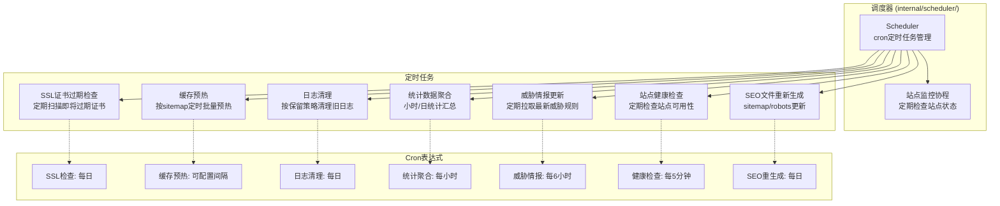
```mermaid
graph TB
    subgraph SchedulerModule["调度器 (internal/scheduler/)"]
        Scheduler["Scheduler<br/>cron定时任务管理"]
        SiteMonitor["站点监控协程<br/>定期检查站点状态"]
    end

    subgraph Tasks["定时任务"]
        T1["SSL证书过期检查<br/>定期扫描即将过期证书"]
        T2["缓存预热<br/>按sitemap定时批量预热"]
        T3["日志清理<br/>按保留策略清理旧日志"]
        T4["统计数据聚合<br/>小时/日统计汇总"]
        T5["威胁情报更新<br/>定期拉取最新威胁规则"]
        T6["站点健康检查<br/>定期检查站点可用性"]
        T7["SEO文件重新生成<br/>sitemap/robots更新"]
    end

    subgraph Cron["Cron表达式"]
        C1["SSL检查: 每日"]
        C2["缓存预热: 可配置间隔"]
        C3["日志清理: 每日"]
        C4["统计聚合: 每小时"]
        C5["威胁情报: 每6小时"]
        C6["健康检查: 每5分钟"]
        C7["SEO重生成: 每日"]
    end

    Scheduler --> T1
    Scheduler --> T2
    Scheduler --> T3
    Scheduler --> T4
    Scheduler --> T5
    Scheduler --> T6
    Scheduler --> T7

    T1 -.-> C1
    T2 -.-> C2
    T3 -.-> C3
    T4 -.-> C4
    T5 -.-> C5
    T6 -.-> C6
    T7 -.-> C7

    Scheduler --> SiteMonitor
```

---

## 15. 前端架构

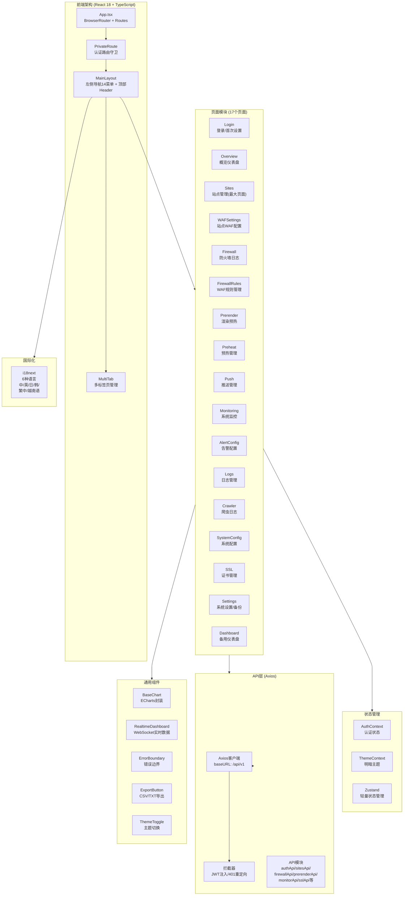
```mermaid
graph TB
    subgraph Frontend["前端架构 (React 18 + TypeScript)"]
        App["App.tsx<br/>BrowserRouter + Routes"]
        Layout["MainLayout<br/>左侧导航14菜单 + 顶部Header"]
        MultiTab["MultiTab<br/>多标签页管理"]
        PrivateRoute["PrivateRoute<br/>认证路由守卫"]
    end

    subgraph Pages["页面模块 (17个页面)"]
        P1["Login<br/>登录/首次设置"]
        P2["Overview<br/>概览仪表盘"]
        P3["Sites<br/>站点管理(最大页面)"]
        P4["WAFSettings<br/>站点WAF配置"]
        P5["Firewall<br/>防火墙日志"]
        P6["FirewallRules<br/>WAF规则管理"]
        P7["Prerender<br/>渲染预热"]
        P8["Preheat<br/>预热管理"]
        P9["Push<br/>推送管理"]
        P10["Monitoring<br/>系统监控"]
        P11["AlertConfig<br/>告警配置"]
        P12["Logs<br/>日志管理"]
        P13["Crawler<br/>爬虫日志"]
        P14["SystemConfig<br/>系统配置"]
        P15["SSL<br/>证书管理"]
        P16["Settings<br/>系统设置/备份"]
        P17["Dashboard<br/>备用仪表盘"]
    end

    subgraph State["状态管理"]
        AuthContext["AuthContext<br/>认证状态"]
        ThemeContext["ThemeContext<br/>明暗主题"]
        Zustand["Zustand<br/>轻量状态管理"]
    end

    subgraph API["API层 (Axios)"]
        ApiClient["Axios客户端<br/>baseURL: /api/v1"]
        Interceptors["拦截器<br/>JWT注入/401重定向"]
        ApiModules["API模块<br/>authApi/sitesApi/<br/>firewallApi/prerenderApi/<br/>monitorApi/sslApi等"]
    end

    subgraph Components["通用组件"]
        BaseChart["BaseChart<br/>ECharts封装"]
        RealtimeDash["RealtimeDashboard<br/>WebSocket实时数据"]
        ErrorBoundary["ErrorBoundary<br/>错误边界"]
        ExportButton["ExportButton<br/>CSV/TXT导出"]
        ThemeToggle["ThemeToggle<br/>主题切换"]
    end

    subgraph i18n["国际化"]
        I18N["i18next<br/>6种语言<br/>中/英/日/韩/<br/>繁中/越南语"]
    end

    App --> PrivateRoute
    PrivateRoute --> Layout
    Layout --> MultiTab
    Layout --> Pages

    Pages --> API
    API --> ApiClient
    ApiClient --> Interceptors

    Pages --> State
    Pages --> Components
    Layout --> i18n
```

---

## 16. 数据存储模型

> **注意**: 以下 Key 模式基于实际源码验证，与早期文档版本可能有差异。

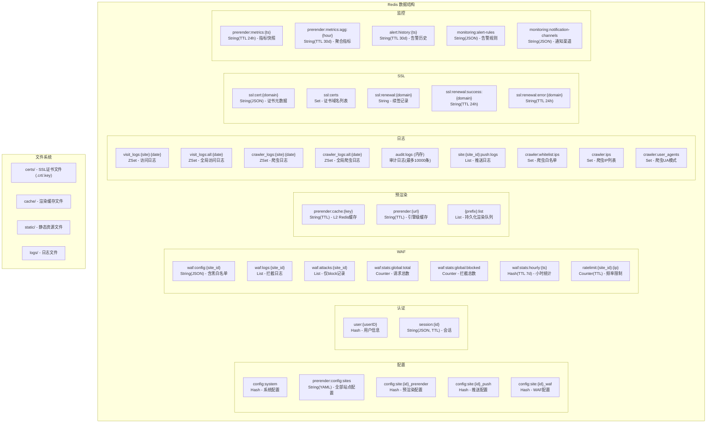
```mermaid
graph TB
    subgraph Redis["Redis 数据结构"]
        subgraph Config["配置"]
            R_C1["config:system<br/>Hash - 系统配置"]
            R_C2["prerender:config:sites<br/>String(YAML) - 全部站点配置"]
            R_C3["config:site:{id}_prerender<br/>Hash - 预渲染配置"]
            R_C4["config:site:{id}_push<br/>Hash - 推送配置"]
            R_C5["config:site:{id}_waf<br/>Hash - WAF配置"]
        end

        subgraph Auth["认证"]
            R_A1["user:{userID}<br/>Hash - 用户信息"]
            R_A2["session:{id}<br/>String(JSON, TTL) - 会话"]
        end

        subgraph WAF["WAF"]
            R_W1["waf:config:{site_id}<br/>String(JSON) - 含黑白名单"]
            R_W2["waf:logs:{site_id}<br/>List - 拦截日志"]
            R_W2B["waf:attacks:{site_id}<br/>List - 仅block记录"]
            R_W3["waf:stats:global:total<br/>Counter - 请求总数"]
            R_W3B["waf:stats:global:blocked<br/>Counter - 拦截总数"]
            R_W4["waf:stats:hourly:{ts}<br/>Hash(TTL 7d) - 小时统计"]
            R_W7["ratelimit:{site_id}:{ip}<br/>Counter(TTL) - 频率限制"]
        end

        subgraph Prerender["预渲染"]
            R_P1["prerender:cache:{key}<br/>String(TTL) - L2 Redis缓存"]
            R_P1B["prerender:{url}<br/>String(TTL) - 引擎级缓存"]
            R_P2["{prefix}:list<br/>List - 持久化渲染队列"]
        end

        subgraph Logs["日志"]
            R_L1["visit_logs:{site}:{date}<br/>ZSet - 访问日志"]
            R_L1B["visit_logs:all:{date}<br/>ZSet - 全局访问日志"]
            R_L2["crawler_logs:{site}:{date}<br/>ZSet - 爬虫日志"]
            R_L2B["crawler_logs:all:{date}<br/>ZSet - 全局爬虫日志"]
            R_L3["audit:logs (内存)<br/>审计日志(最多10000条)"]
            R_L4["site:{site_id}:push:logs<br/>List - 推送日志"]
            R_L5["crawler:whitelist:ips<br/>Set - 爬虫白名单"]
            R_L6["crawler:ips<br/>Set - 爬虫IP列表"]
            R_L7["crawler:user_agents<br/>Set - 爬虫UA模式"]
        end

        subgraph SSL["SSL"]
            R_S1["ssl:cert:{domain}<br/>String(JSON) - 证书元数据"]
            R_S2["ssl:certs<br/>Set - 证书域名列表"]
            R_S3["ssl:renewal:{domain}<br/>String - 续签记录"]
            R_S3B["ssl:renewal:success:{domain}<br/>String(TTL 24h)"]
            R_S3C["ssl:renewal:error:{domain}<br/>String(TTL 24h)"]
        end

        subgraph Monitoring["监控"]
            R_M1["prerender:metrics:{ts}<br/>String(TTL 24h) - 指标快照"]
            R_M1B["prerender:metrics:agg:{hour}<br/>String(TTL 30d) - 聚合指标"]
            R_M2["alert:history:{ts}<br/>String(TTL 30d) - 告警历史"]
            R_M3["monitoring:alert-rules<br/>String(JSON) - 告警规则"]
            R_M4["monitoring:notification-channels<br/>String(JSON) - 通知渠道"]
        end
    end

    subgraph FileSystem["文件系统"]
        FS1["certs/ - SSL证书文件(.crt/.key)"]
        FS2["cache/ - 渲染缓存文件"]
        FS3["static/ - 静态资源文件"]
        FS4["logs/ - 日志文件"]
    end
```

---

## 17. 部署架构

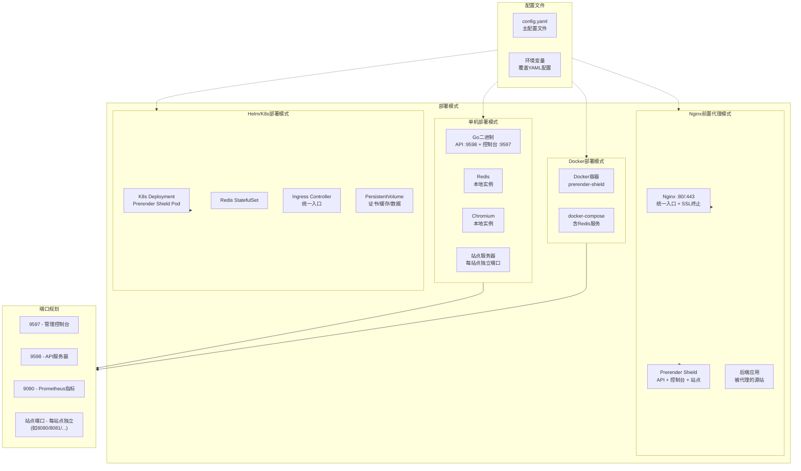
```mermaid
graph TB
    subgraph Deployment["部署模式"]

        subgraph Standalone["单机部署模式"]
            SA1["Go二进制<br/>API :9598 + 控制台 :9597"]
            SA2["Redis<br/>本地实例"]
            SA3["Chromium<br/>本地实例"]
            SA4["站点服务器<br/>每站点独立端口"]
        end

        subgraph Docker["Docker部署模式"]
            DK1["Docker容器<br/>prerender-shield"]
            DK2["docker-compose<br/>含Redis服务"]
        end

        subgraph NginxMode["Nginx前置代理模式"]
            NX1["Nginx :80/:443<br/>统一入口 + SSL终止"]
            NX2["Prerender Shield<br/>API + 控制台 + 站点"]
            NX3["后端应用<br/>被代理的源站"]
        end

        subgraph HelmMode["Helm/K8s部署模式"]
            K8S1["K8s Deployment<br/>Prerender Shield Pod"]
            K8S2["Redis StatefulSet"]
            K8S3["Ingress Controller<br/>统一入口"]
            K8S4["PersistentVolume<br/>证书/缓存/数据"]
        end
    end

    subgraph Ports["端口规划"]
        Port1["9597 - 管理控制台"]
        Port2["9598 - API服务器"]
        Port3["9090 - Prometheus指标"]
        Port4["站点端口 - 每站点独立<br/>(如8080/8081/...)"]
    end

    subgraph Config["配置文件"]
        YAML["config.yaml<br/>主配置文件"]
        Env["环境变量<br/>覆盖YAML配置"]
    end

    Standalone --> Ports
    Docker --> Ports
    NginxMode --> NX1
    NginxMode --> NX2
    HelmMode --> K8S1

    Config -.-> Standalone
    Config -.-> Docker
    Config -.-> NginxMode
    Config -.-> HelmMode
```

---

## 附录：API 路由总览

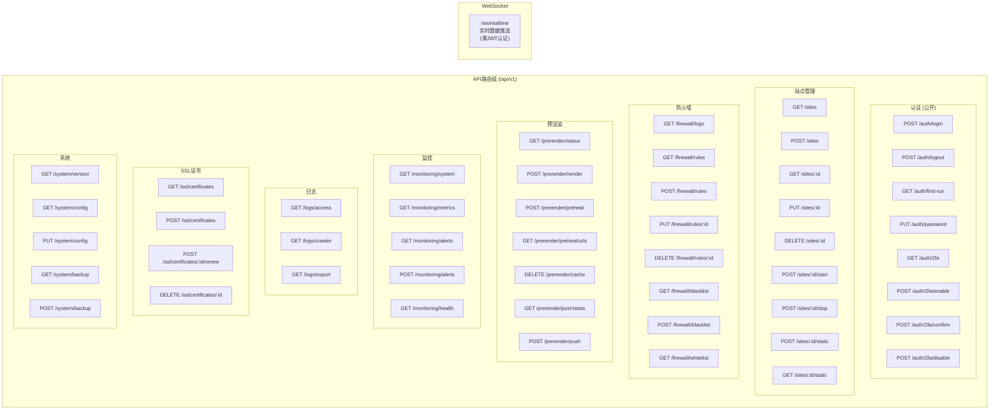
```mermaid
graph LR
    subgraph APIRoutes["API路由组 (/api/v1)"]
        subgraph Auth["认证 (公开)"]
            A1["POST /auth/login"]
            A2["POST /auth/logout"]
            A3["GET /auth/first-run"]
            A4["PUT /auth/password"]
            A5["GET /auth/2fa"]
            A6["POST /auth/2fa/enable"]
            A7["POST /auth/2fa/confirm"]
            A8["POST /auth/2fa/disable"]
        end

        subgraph Sites["站点管理"]
            S1["GET /sites"]
            S2["POST /sites"]
            S3["GET /sites/:id"]
            S4["PUT /sites/:id"]
            S5["DELETE /sites/:id"]
            S6["POST /sites/:id/start"]
            S7["POST /sites/:id/stop"]
            S8["POST /sites/:id/static"]
            S9["GET /sites/:id/static"]
        end

        subgraph Firewall["防火墙"]
            F1["GET /firewall/logs"]
            F2["GET /firewall/rules"]
            F3["POST /firewall/rules"]
            F4["PUT /firewall/rules/:id"]
            F5["DELETE /firewall/rules/:id"]
            F6["GET /firewall/blacklist"]
            F7["POST /firewall/blacklist"]
            F8["GET /firewall/whitelist"]
        end

        subgraph Prerender["预渲染"]
            P1["GET /prerender/status"]
            P2["POST /prerender/render"]
            P3["POST /prerender/preheat"]
            P4["GET /prerender/preheat/urls"]
            P5["DELETE /prerender/cache"]
            P6["GET /prerender/push/stats"]
            P7["POST /prerender/push"]
        end

        subgraph Monitor["监控"]
            M1["GET /monitoring/system"]
            M2["GET /monitoring/metrics"]
            M3["GET /monitoring/alerts"]
            M4["POST /monitoring/alerts"]
            M5["GET /monitoring/health"]
        end

        subgraph Logs["日志"]
            L1["GET /logs/access"]
            L2["GET /logs/crawler"]
            L3["GET /logs/export"]
        end

        subgraph SSL["SSL证书"]
            SS1["GET /ssl/certificates"]
            SS2["POST /ssl/certificates"]
            SS3["POST /ssl/certificates/:id/renew"]
            SS4["DELETE /ssl/certificates/:id"]
        end

        subgraph System["系统"]
            SY1["GET /system/version"]
            SY2["GET /system/config"]
            SY3["PUT /system/config"]
            SY4["GET /system/backup"]
            SY5["POST /system/backup"]
        end
    end

    subgraph WS["WebSocket"]
        WS1["/ws/realtime<br/>实时数据推送<br/>(需JWT认证)"]
    end
```

---

**文档完成日期**: 2026-06-17
**二次审核更新**: 2026-06-17 (修正 Redis Key 模式、健康检查项、预渲染子模块结构)
**基于源码版本**: 当前主分支
**图表工具**: Mermaid (支持GitHub/GitLab/VS Code原生渲染)
