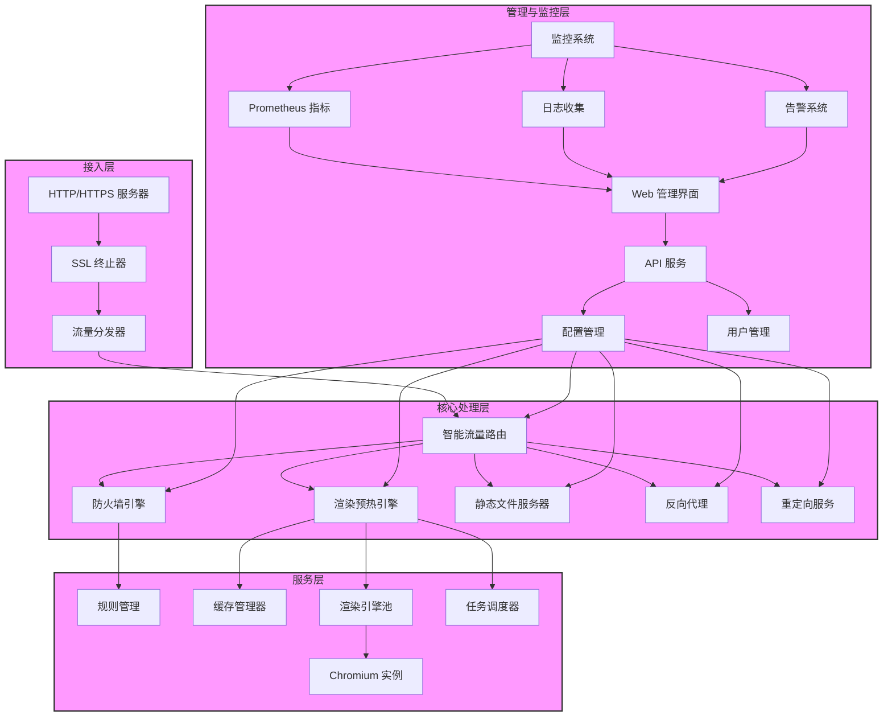
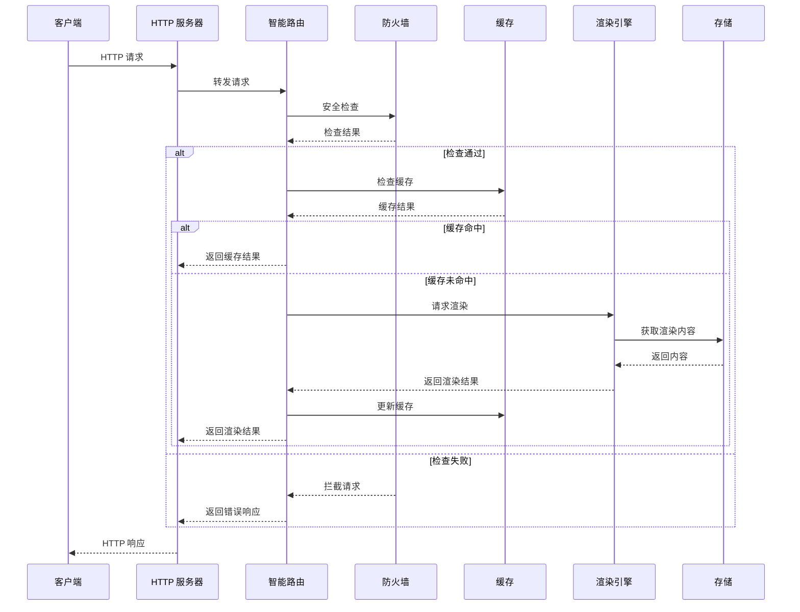
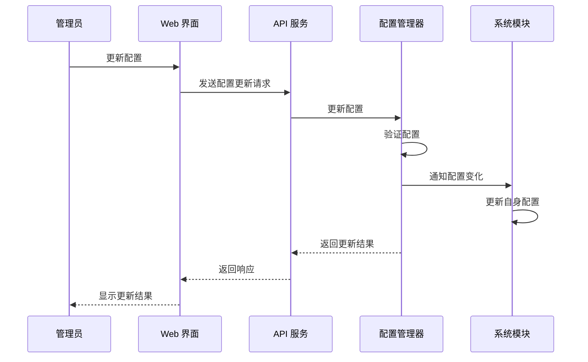
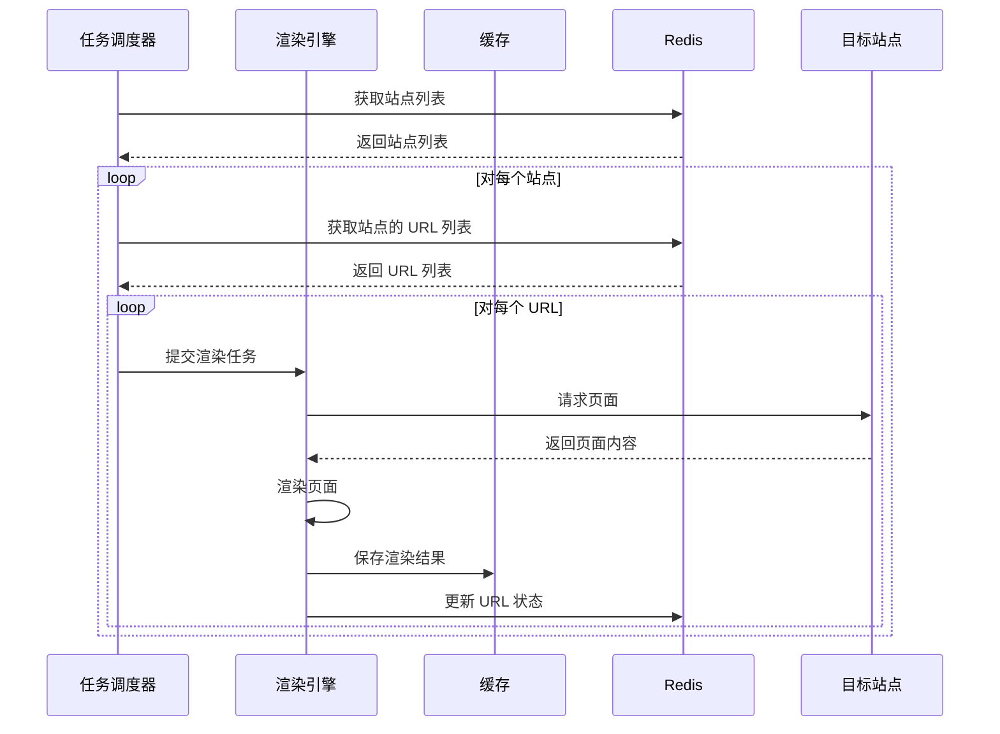
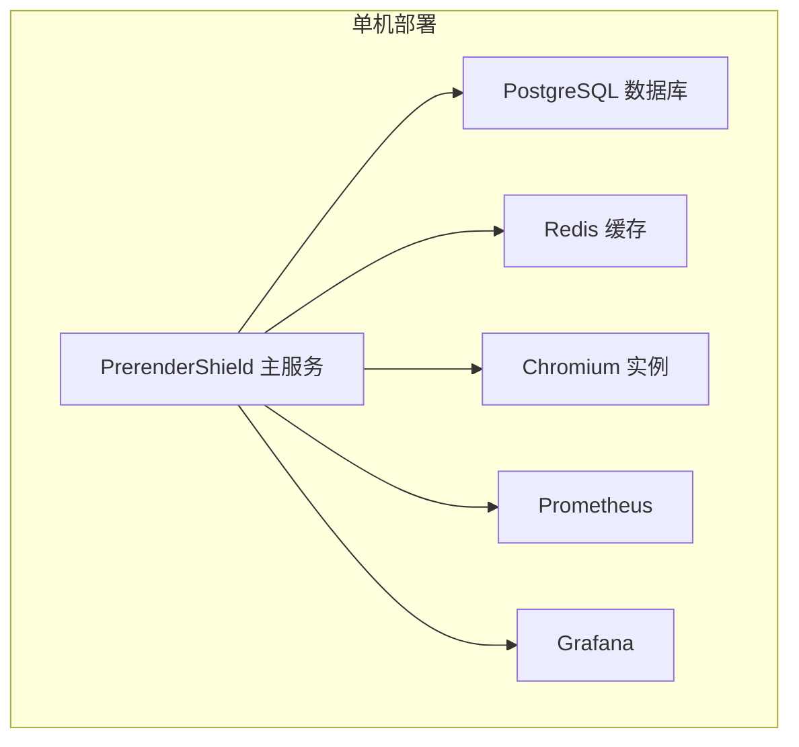
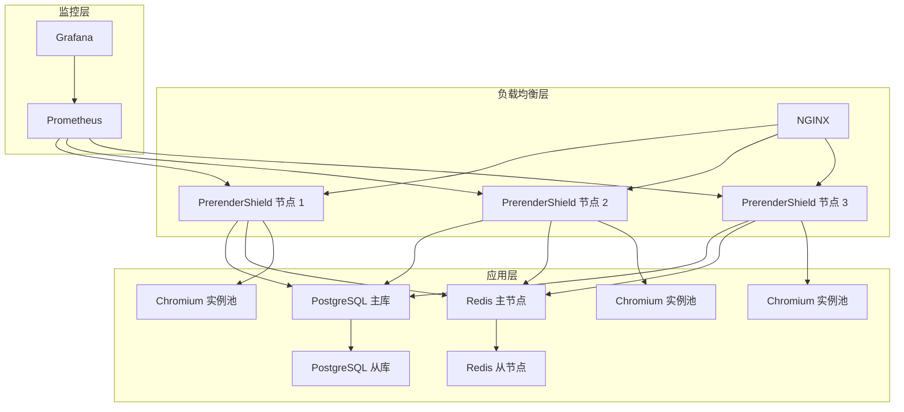

# PrerenderShield 架构文档

## 1. 架构概述

PrerenderShield 采用分层架构设计，基于模块化原则，实现了高内聚、低耦合的系统结构。系统分为四个主要层次：接入层、核心处理层、服务层和管理与监控层。各层之间通过明确的接口进行通信，便于独立开发、测试和部署。

### 1.1 设计原则

- **模块化设计**：将系统划分为独立的模块，每个模块负责特定的功能
- **高内聚低耦合**：模块内部功能高度相关，模块间通过明确的接口通信
- **可扩展性**：支持水平扩展，满足高并发需求
- **容错性**：具备故障检测和恢复机制
- **可观测性**：完善的监控和日志系统
- **安全性**：内置安全防护机制

## 2. 系统架构图

## 3. 模块设计

### 3.1 配置管理模块

**责任**：管理系统配置，支持动态加载和热更新

**设计**：
- 采用单例模式，确保全局只有一个配置管理器实例
- 支持从文件和环境变量加载配置
- 实现配置验证机制，确保配置的合法性
- 支持配置变化通知，当配置变化时通知相关模块
- 实现配置文件监控，支持热重载

**主要组件**：
- `ConfigManager`：配置管理器核心类
- `Config`：配置数据结构
- `ConfigChangeHandler`：配置变化处理函数类型

**关键函数**：
- `LoadConfig()`：加载配置
- `ValidateConfig()`：验证配置
- `UpdateConfig()`：更新配置
- `StartWatching()`：开始监控配置文件
- `StopWatching()`：停止监控配置文件

### 3.2 渲染预热模块

**责任**：处理爬虫请求，渲染 SPA 页面

**设计**：
- 采用引擎池设计，管理多个渲染引擎实例
- 支持动态扩缩容，根据负载调整引擎数量
- 实现缓存机制，避免重复渲染
- 支持多种渲染策略（同步、异步）
- 实现超时控制，防止单个请求阻塞整个系统

**主要组件**：
- `EngineManager`：渲染引擎管理器
- `Engine`：渲染引擎实例
- `RenderTask`：渲染任务
- `PreheatManager`：缓存预热管理器

**关键流程**：
1. 接收爬虫请求
2. 检查缓存
3. 如果缓存命中，直接返回缓存结果
4. 如果缓存未命中，从引擎池获取引擎
5. 执行渲染任务
6. 缓存渲染结果
7. 返回渲染结果

### 3.3 防火墙模块

**责任**：提供安全防护，防止各种攻击

**设计**：
- 基于规则的模块化设计
- 支持多种检测引擎（SQL 注入、XSS、CSRF 等）
- 支持自定义规则
- 实现规则优先级管理
- 支持实时规则更新

**主要组件**：
- `Engine`：防火墙引擎
- `Rule`：规则接口
- `Detector`：检测引擎接口
- `Action`：动作接口（block、log、redirect 等）

**支持的攻击类型**：
- SQL 注入
- 跨站脚本（XSS）
- 跨站请求伪造（CSRF）
- 命令注入
- 路径遍历
- 文件包含
- XML 外部实体（XXE）
- 不安全的反序列化

### 3.4 监控模块

**责任**：监控系统运行状态，收集指标和日志

**设计**：
- 基于 Prometheus 生态
- 支持多种监控指标
- 实现实时监控
- 支持告警通知
- 集成日志收集

**主要组件**：
- `Monitor`：监控管理器
- `Metrics`：指标定义
- `Collector`：指标收集器
- `Exporter`：指标导出器

**监控指标**：
- 请求指标：请求总数、响应时间、状态码分布
- 系统指标：CPU、内存、磁盘使用情况
- 业务指标：爬虫请求数、渲染时间、缓存命中率
- 安全指标：防火墙拦截数、攻击类型分布

### 3.5 日志模块

**责任**：记录系统运行日志，支持多种日志级别和格式

**设计**：
- 支持多种日志级别（DEBUG、INFO、WARN、ERROR、FATAL）
- 支持多种日志格式（文本、JSON）
- 支持日志轮转
- 实现审计日志
- 支持日志级别动态调整

**主要组件**：
- `Logger`：日志记录器
- `AuditLogger`：审计日志记录器
- `LogEntry`：日志条目

**日志类型**：
- 应用日志：记录应用运行状态
- 访问日志：记录 HTTP 请求
- 审计日志：记录管理员操作
- 安全日志：记录安全事件

## 4. 数据流设计

### 4.1 请求处理流程

### 4.2 配置更新流程

### 4.3 渲染预热流程

## 5. 技术选型

| 类别 | 技术 | 版本 | 选型理由 |
|------|------|------|----------|
| 后端框架 | Gin | 1.9.0 | 高性能、轻量级、易于扩展 |
| 渲染引擎 | Puppeteer | 21.0+ | 成熟稳定、支持最新的 Web 标准 |
| 无头浏览器 | Chromium | 110+ | 高性能、支持最新的 Web 特性 |
| 缓存 | Redis | 7.0+ | 高性能、支持多种数据结构 |
| 数据库 | PostgreSQL | 14.0+ | 可靠、支持复杂查询、事务 |
| 监控 | Prometheus | 2.40+ | 强大的指标收集和查询功能 |
| 日志 | Zap | 1.24.0 | 高性能、结构化日志 |
| 容器化 | Docker | 20.0+ | 便于部署和管理 |
| 容器编排 | Kubernetes | 1.20+ | 支持水平扩展、滚动更新 |

## 6. 部署架构

### 6.1 单机部署

适合开发和测试环境，所有组件部署在同一台机器上。

### 6.2 集群部署

适合生产环境，支持水平扩展，具备高可用性。

## 7. 关键设计决策

### 7.1 渲染引擎池设计

**问题**：频繁创建和销毁 Chromium 实例会导致性能问题

**解决方案**：实现渲染引擎池，复用 Chromium 实例

**设计**：
- 维护一个 Chromium 实例池
- 支持动态扩缩容，根据负载调整实例数量
- 实现实例健康检查机制
- 支持实例回收和重建

### 7.2 智能流量路由

**问题**：不同类型的请求需要不同的处理方式

**解决方案**：实现智能流量路由，根据请求类型和站点配置分发请求

**设计**：
- 基于 User-Agent 检测爬虫请求
- 根据站点配置（mode）决定处理方式
- 支持静态文件、反向代理、重定向等多种处理方式
- 实现可扩展的路由规则

### 7.3 缓存策略

**问题**：重复渲染会导致性能问题

**解决方案**：实现多级缓存策略

**设计**：
- 内存缓存：高频访问的页面
- Redis 缓存：所有渲染结果
- 支持配置缓存 TTL
- 支持缓存预热

### 7.4 配置热更新

**问题**：配置更新需要重启服务

**解决方案**：实现配置热更新机制

**设计**：
- 监控配置文件变化
- 支持动态加载配置
- 实现配置变化通知
- 支持配置回滚

## 8. 扩展性设计

### 8.1 模块扩展

系统采用插件化设计，支持通过实现接口扩展功能：

- 防火墙规则：实现 `Rule` 接口
- 检测引擎：实现 `Detector` 接口
- 动作处理：实现 `Action` 接口
- 渲染引擎：实现 `Renderer` 接口

### 8.2 水平扩展

支持通过增加实例数量实现水平扩展：

- 无状态设计，支持负载均衡
- 共享存储（PostgreSQL、Redis）
- 独立的 Chromium 实例池

### 8.3 功能扩展

支持通过 API 扩展功能：

- RESTful API 设计
- 支持自定义插件
- 支持 Webhook 集成

## 9. 安全性设计

### 9.1 内置安全机制

- 防火墙引擎，防护 OWASP Top 10 攻击
- HTTPS 支持，SSL 证书自动管理
- 访问控制，基于角色的权限管理
- 审计日志，记录所有管理员操作
- 输入验证，防止注入攻击
- 输出编码，防止 XSS 攻击

### 9.2 安全最佳实践

- 最小权限原则
- 定期安全审计
- 漏洞扫描
- 安全更新机制
- 安全配置默认值

## 10. 可观测性设计

### 10.1 监控指标

- 请求指标：请求总数、响应时间、状态码分布
- 系统指标：CPU、内存、磁盘使用情况
- 业务指标：爬虫请求数、渲染时间、缓存命中率
- 安全指标：防火墙拦截数、攻击类型分布

### 10.2 日志系统

- 结构化日志格式
- 支持日志级别动态调整
- 支持日志轮转
- 审计日志，记录所有重要操作

### 10.3 告警机制

- 基于 Prometheus Alertmanager
- 支持多种告警渠道（邮件、Slack、Webhook 等）
- 预定义告警规则
- 支持自定义告警规则

## 11. 故障恢复设计

### 11.1 故障检测

- 健康检查机制
- 心跳检测
- 自动故障检测

### 11.2 故障恢复

- 渲染引擎自动重启
- 缓存自动重建
- 服务自动恢复
- 数据备份和恢复

## 12. 性能优化

### 12.1 渲染优化

- 渲染引擎池复用
- 并行渲染
- 缓存机制
- 渲染超时控制

### 12.2 网络优化

- HTTP/2 支持
- 连接复用
- 压缩传输
- CDN 集成

### 12.3 存储优化

- 高效的数据库查询
- 索引优化
- 缓存策略
- 数据分区

## 13. 总结

PrerenderShield 采用分层架构设计，基于模块化原则，实现了高内聚、低耦合的系统结构。系统具备良好的可扩展性、容错性和可观测性，支持水平扩展，满足高并发需求。系统内置安全防护机制，提供完善的监控和日志系统，便于运维和管理。

架构设计考虑了性能、安全性、可扩展性等多个方面，采用了多种设计模式和最佳实践，确保系统的稳定性和可靠性。系统支持通过插件化方式扩展功能，便于适应不同的业务需求。
