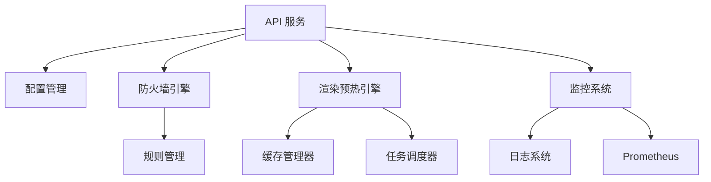

# PrerenderShield 项目文档

## 1. 项目概述

PrerenderShield 是一款集防火墙安全防护与渲染预热功能于一体的企业级 Web 应用中间件，专为解决前后端分离架构下网站发布的痛点而设计。现有防火墙产品（如雷池）无法支持渲染预热，而渲染预热产品（如 Rendertron）缺乏防火墙能力，PrerenderShield 填补了这一市场空白，为用户提供一站式的安全防护与 SEO 优化解决方案。

### 1.1 项目背景

随着前后端分离架构的普及，SPA（单页应用）已成为主流开发模式。然而，SPA 应用面临两大核心问题：

1. **SEO 优化困难**：搜索引擎爬虫难以有效抓取和解析 SPA 应用，导致网站在搜索结果中的排名下降。
2. **安全防护不足**：传统防火墙产品主要针对服务器端应用设计，对 SPA 应用的防护效果有限。

PrerenderShield 旨在解决这两个问题，为前后端分离架构提供完整的解决方案。

### 1.2 项目目标

- 提供全方位的 OWASP Top 10 安全防护
- 实现智能渲染预热，提升 SEO 效果
- 支持多种站点模式（proxy、static、redirect）
- 提供现代化的管理界面
- 支持水平扩展，满足高并发需求
- 提供完善的监控和日志系统

## 2. 技术栈

| 类别 | 技术 | 版本 | 用途 |
|------|------|------|------|
| 后端 | Go | 1.20+ | 高性能后端服务 |
| 前端 | React | 18 | 现代化管理界面 |
| 前端 | TypeScript | 5.0+ | 类型安全 |
| 前端 | Ant Design | 5.0+ | UI 组件库 |
| 前端 | ECharts | 5.0+ | 数据可视化 |
| 渲染引擎 | Puppeteer | 21.0+ | 页面渲染 |
| 渲染引擎 | Chromium | 110+ | 无头浏览器 |
| 容器化 | Docker | 20.0+ | 容器化部署 |
| 容器编排 | Kubernetes | 1.20+ | 容器编排 |
| 数据库 | PostgreSQL | 14.0+ | 配置和日志存储 |
| 缓存 | Redis | 7.0+ | 缓存和队列 |
| 监控 | Prometheus | 2.40+ | 监控指标收集 |
| 监控 | Grafana | 9.0+ | 监控数据可视化 |

## 3. 系统架构

### 3.1 四层架构设计

PrerenderShield 采用四层架构设计，各层职责清晰，便于扩展和维护：

1. **接入层**：处理 HTTP/HTTPS 请求，SSL 终止，流量分发
2. **核心处理层**：智能流量路由，防火墙引擎，渲染预热引擎
3. **服务层**：规则管理，缓存管理，证书管理，任务调度
4. **管理与监控层**：Web 管理界面，日志系统，告警系统，API 服务

### 3.2 核心组件

- **防火墙引擎**：基于 OWASP 规则的模块化检测系统
- **渲染预热引擎**：Headless Chrome/Chromium + Puppeteer
- **缓存管理器**：多级缓存策略，支持 Redis/Memory
- **ACME 客户端**：自动 Let's Encrypt 证书管理
- **任务调度器**：缓存预热、定期扫描等后台任务

### 3.3 模块依赖关系



## 4. 开发环境搭建

### 4.1 系统要求

- CPU：4 核（推荐 8 核）
- 内存：8GB（推荐 16GB）
- 磁盘：100GB（推荐 200GB SSD）
- 操作系统：Linux/macOS

### 4.2 安装步骤

1. **安装 Go 环境**
   ```bash
   tar -C /usr/local -xzf go1.20.0.linux-amd64.tar.gz
   export PATH=$PATH:/usr/local/go/bin
   ```

2. **安装 Node.js**
   ```bash
   nvm install 18
   nvm use 18
   ```

3. **安装 Docker**
   ```bash
   sudo apt-get install docker-ce docker-ce-cli containerd.io
   ```

4. **克隆项目**
   ```bash
   git clone https://github.com/your-org/prerendershield.git
   cd prerendershield
   ```

5. **安装依赖**
   ```bash
   go mod tidy
   cd web
   npm install
   ```

6. **启动开发服务器**
   ```bash
   # 启动后端服务
   go run cmd/api/main.go
   
   # 启动前端开发服务器
   cd web
   npm run dev
   ```

## 5. 部署方式

### 5.1 Docker 部署

```bash
docker-compose up -d
```

### 5.2 Kubernetes 部署

```bash
kubectl apply -f deploy/k8s/deployment.yaml
kubectl apply -f deploy/k8s/service.yaml
```

### 5.3 配置文件

配置文件路径：`configs/config.yml`

主要配置项：
- `server`：服务器配置（地址、端口等）
- `dirs`：目录配置（数据目录、静态文件目录等）
- `cache`：缓存配置（类型、Redis URL 等）
- `storage`：存储配置（PostgreSQL URL 等）
- `monitoring`：监控配置（Prometheus 地址等）
- `sites`：站点配置列表

## 6. 开发流程

### 6.1 代码规范

- 采用 Go 官方代码规范
- 使用 `gofmt` 进行代码格式化
- 使用 `golangci-lint` 进行代码检查
- 前端使用 ESLint 和 Prettier

### 6.2 测试流程

- 单元测试：`go test ./internal/...`
- 集成测试：`go test ./tests/...`
- 端到端测试：`npm run e2e`（前端）

### 6.3 提交规范

- 提交信息格式：`type(scope): description`
- 类型：feat, fix, docs, style, refactor, test, chore
- 示例：`feat(config): add hot reload support`

## 7. 监控与维护

### 7.1 监控指标

- 请求总数、响应时间、状态码分布
- 爬虫请求数、渲染时间
- 防火墙拦截数、缓存命中率
- 系统资源使用情况（CPU、内存、磁盘）

### 7.2 日志管理

- 应用日志：`logs/app.log`
- 访问日志：`logs/access.log`
- 审计日志：存储在 PostgreSQL 中
- 错误日志：`logs/error.log`

### 7.3 常见问题排查

1. **渲染失败**：检查 Chromium 进程状态，查看渲染日志
2. **防火墙误判**：检查规则配置，调整规则优先级
3. **性能问题**：查看监控指标，调整资源配置
4. **配置不生效**：检查配置文件格式，查看配置加载日志

## 8. 未来规划

### 8.1 近期计划

- 支持更多的渲染引擎（如 Playwright）
- 实现更细粒度的访问控制
- 提供更丰富的监控指标和告警规则
- 支持多租户部署

### 8.2 长期规划

- 支持 Serverless 部署
- 实现 AI 驱动的规则自动生成
- 支持边缘计算部署
- 提供更丰富的 API 和集成能力

## 9. 联系方式

- 项目地址：https://github.com/your-org/prerendershield
- 文档地址：https://prerendershield.io/docs
- 问题反馈：https://github.com/your-org/prerendershield/issues
- 邮件：contact@prerendershield.io

## 10. 许可证

MIT License
